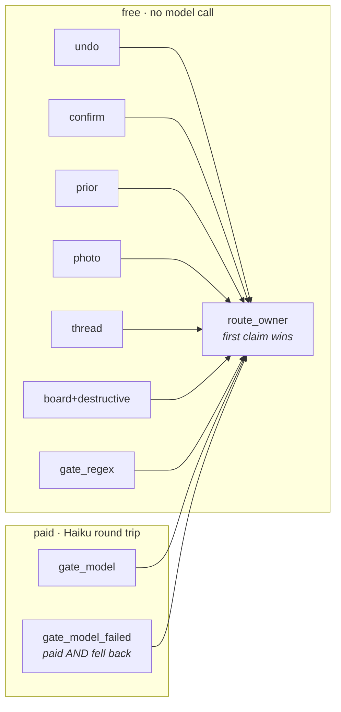

# Arnie architecture — seams, routing, latency

**Date:** 2026-07-29 · **Base:** `1aabb42` · **Predecessor:** [`NUTRITION_LANE_AUDIT_2026-07-28.md`](NUTRITION_LANE_AUDIT_2026-07-28.md)

Covers the four-day sprint (Days 1–4 landed, Day 5 open) and the seams that remain.
The 07-28 audit is still correct on the lane's *behaviour*; this one supersedes it on
**routing, latency, voice ownership, and reachability**, all of which moved.

**Evidence key** — every claim below carries one:
· `M` measured locally (probe or test) · `C` read from code at `1aabb42`
· `P` from production logs Danny supplied · `?` **unverified — needs a production window**

---

## 1. Deployed configuration

| Flag | Value | Effect |
|---|---|---|
| `STRUCTURED_FOOD` | *(unset → true)* | structured lane on |
| `FOOD_GATE_MODEL` | `true` | Haiku decides food-vs-not for what the regexes miss |
| `FOOD_COMPOSER` | `true` | model writes the reply; also gates the interpreter's narration cut |
| `NUTRITION_RESOLVER_MODE` | `live` | resolver owns the numbers (**not** shadow — corrected from an earlier note) |
| `FOOD_FAST_PATH_SHADOW` | `on` | **new** — zero-call parser measures itself, acts on nothing |
| `FOOD_FAST_PATH` | *(absent)* | the switch that would let it write. Deliberately unset |
| `TURN_COORDINATOR_MODE` | `new_observe` | coordinator predicts, never executes |
| `FOOD_VOICE_DEADLINE_S` | *(unset → 6.0)* | **new** — stage deadline on the voice call |

---

## 2. The live request path

```mermaid
flowchart TD
    A["POST /chat · WS _stream_turn<br/><i>api/chat.py:325 / :652</i>"] --> B["chat_service.py:406"]
    B --> C["conversation.run_turn:665<br/><b>_turn_t0</b> :680"]

    C --> D{{"deterministic — zero model calls"}}
    D --> D1["_sft_prior · open clarification"]
    D --> D2["_photo_food"]
    D --> D3["_route_mid · thread_relevance"]
    D --> D4["ledger_undo.build_plan :913"]
    D --> D5["_confirm_hit :917"]
    D --> D6["_board + _sft_dest"]

    D1 & D2 & D3 & D4 & D5 & D6 --> E["_food_now :943<br/><b>claims route_owner</b>"]
    E -->|any free signal| G["ENTER LANE"]
    E -->|cold start| F["applies&#40;&#41; regex<br/><i>free</i>"]
    F -->|miss| F2["food_relevance :544<br/><b>HAIKU · max_tokens=4</b>"]
    F -->|hit| G
    F2 -->|yes| G
    F2 -->|no| L["_to_legacy&#40;reason&#41;"]

    G --> H["CONTEXT stage<br/>board · regulars · day · last assistant"]
    H --> I["interpreter :3176<br/><b>SONNET · max_tokens=700</b>"]
    I -.->|stream| I2["_SpeculativeEnrichment<br/>① heads-up ~212ms<br/>② USDA/OFF lookups"]
    I --> J{action}
    J -->|ask, renderable| K1["CLARIFY → render"]
    J -->|ask, no points| K2["_ask_becomes_log<br/><i>stays in lane</i>"]
    J -->|log/update/delete| K3["pipeline → policy"]
    K2 --> K3
    K3 --> N["EXECUTE · exactly-once ledger"]
    N --> O["committed snapshot"]
    O --> P["voice layer<br/><b>compile_voice&#40;profile&#41;</b>"]
    P -->|ok| Q["reply + card<br/><i>done-frame</i>"]
    P -->|fail / timeout| R["deterministic floor"]
    R --> Q
    L --> Z["LEGACY LANE<br/><i>full thread · free-form log_food</i>"]

    style F2 fill:#c0392b,color:#fff
    style I fill:#c0392b,color:#fff
    style P fill:#b7791f,color:#fff
    style Z fill:#7d3c98,color:#fff
    style K2 fill:#1e8449,color:#fff
```



Red = model call on the critical path. Purple = the escape that must not happen silently.

---

## 3. Routing — who owns the decision

The free signals were reordered ahead of the model gate upstream of this sprint `C`.
What this sprint added is the ability to **count** it: `route_owner` is claimed by
whoever decides, first-claim-wins.



**Why first-claim-wins:** the shadow coordinator calls `food_relevance` again late in the
same turn. Under overwrite semantics that second call would relabel every free-signal turn
`gate_model`, and the histogram would report we pay Haiku on *every* turn — the exact
inverse of what it measures `C`.

**The open question:** the gate's own docstring says `applies()` misses **64% of real food
messages** over 1,008 production messages `C`. If that still holds, the ≤1-decision-model-call
target is missed on most food turns. `route_owner=gate_model` now answers it `?`.

---

## 4. Critical path by turn type

| Turn | Decision-model calls | Network | Bounded? | Notes |
|---|---|---|---|---|
| simple log (`applies()` hit) | 1 — interpreter | USDA/OFF, overlapped | ✅ | enrichment overlaps generation `M` |
| simple log (regex miss) | **2** — gate + interpreter | same | ✅ | the ≤1 miss |
| branded log | 1–2 | + `_variant_spreads`, materiality-gated | ✅ | gate runs *before* the fetch |
| vague restaurant meal | 1–2 | + variants | ✅ | usually becomes an ask |
| multi-item meal | 1–2 | per-item, single-flighted | ✅ | speculative fetch per name |
| correction | 1–2 | usually none | ✅ | board-anchored |
| clarification answer | 1–2 | none | ✅ | early heads-up suppressed by design |
| deletion / undo | **0** | none | ✅ | `ledger_undo`, deterministic |
| mixed food + non-food | 1–2 | as above | ✅ | forces `coaching` profile |
| photo | 1–2 + vision | as above | ✅ | heaviest card path |
| non-food routed away | 0–1 (gate) | none | ✅ | `_to_legacy` with a reason |

Voice adds up to **2 more model calls** (generate + one validation retry), now under a
6s stage deadline and the turn budget `M`.

---

## 5. Latency — what moved and what did not

```mermaid
gantt
    title A commit turn, before and after (indicative, not measured end-to-end)
    dateFormat X
    axisFormat %Ss
    section before
    silence            :crit, b1, 0, 4
    interpreter        :b2, 0, 4
    enrichment         :b3, 4, 5
    heads-up (too late):milestone, b4, 4, 0
    compose            :b5, 9, 1
    first visible      :milestone, b6, 4, 0
    section after
    interpreter        :a2, 0, 3
    heads-up           :milestone, a4, 1, 0
    enrichment (overlapped) :a3, 1, 3
    compose            :a5, 3, 1
    first visible      :milestone, a6, 1, 0
```



**Landed**

| Change | Evidence |
|---|---|
| enrichment overlaps generation | `M` enrichment added 0.00s over generation |
| heads-up fires **during** the interpreter | `M` 212ms of 1,218ms of simulated generation, 17% in |
| interpreter narration cut | `M` 39% of output tokens, per-field on 4 real responses `P` |
| voice call under the turn budget + 6s stage deadline | `M` 30s hang → 0.31s, correct reply |
| prompt cache confirmed working | `M` 5,940/6,183 = 96% cached on a warm probe |
| voice prompt: ~3,629 → ~1,645 tok on routine turns | `M` |

**Not landed**

- **`commit_visible` ≈ `complete_ms`** `C` — the committed result is not visible until the
  turn completes. This is the gap the early card exists to open.
- **The gate's second model call** — measurable now, not yet cut.
- **The interpreter's remaining floor** — TTFB plus the rows. The rows *are* the decision;
  nothing left to cut there without cutting substance.

**Ruled out, so nobody chases it:** prefill/prompt caching. No `CACHE_BREAK` marker means
the whole system block is cached at 1h TTL, and `_SYSTEM` is stable per mode `M`.

---

## 6. Voice architecture

```mermaid
flowchart TD
    CANON["<b>core/prompts/arnie.py</b><br/>IDENTITY · LANGUAGE · VOICE · EMOJI<br/><i>authoritative</i>"]
    CANON -->|lifted by anchor| CTR["10 contracts<br/><i>core/prompts/voice.py</i>"]
    CTR --> P1["micro_acknowledgement<br/>~1,247 tok"]
    CTR --> P2["clarification<br/>~1,377 tok"]
    CTR --> P3["coaching<br/>~2,074 tok"]
    CTR --> P4["recovery<br/>~1,226 tok"]
    CTR -->|banned_phrases&#40;&#41;| CHK["voice.check&#40;&#41;<br/><i>mechanical linter</i>"]

    P1 & P2 & P3 & P4 --> BP["build_prompt → compose_async"]
    BP -->|ok| OUT["reply"]
    BP -->|fail/timeout| FLOOR["deterministic floors<br/>_deterministic_line · fallback&#40;&#41;<br/>clarify_text_from_points"]
    CHK -.->|asserted over output| FLOOR
    FLOOR --> OUT

    style CANON fill:#1a5490,color:#fff
    style CHK fill:#1e8449,color:#fff
```



**The guarantee:** a profile is a *selection*, never a rewrite.
`test_editing_the_canonical_voice_changes_every_profile` edits the persona and asserts all
four inherit it — if that ever passes while the profiles hold still, the compiler has become
a fifth personality `M`.

**Plan-aware, not intent-aware:** a mixed turn (`COMMIT` + non-food context) is upgraded to
`coaching`. Before that fix the prompt both demanded and forbade an acknowledgement `M`.

**The floors** are now held to the persona mechanically. That caught a real violation: the
canonical voice ends *"never one bubble alone after logging food"* and `_deterministic_line`
was one bubble `M`.

---

## 7. Remaining seams, ranked

### S1 · The committed result is invisible until the turn ends
`on_card` is declared, threaded through three layers, and **invoked nowhere** — 0 call sites
by AST `M`. Disabled deliberately 2026-07-20: the card arrived before the user's own message.
The early heads-up now means a bubble always precedes it, which likely answers the objection —
but that is a claim about the iOS client's frame ordering, **not verifiable from the backend** `?`.
**Blocked on:** how the client orders a `card` frame arriving after a text bubble.

### S2 · Two decision-model calls on most food turns
`applies()` misses 64% per its own docstring `C`. `route_owner` measures the real share `?`.
**Options:** trust the regex tier further, or fold the decision into the interpreter. Both
change routing behaviour, so neither should move before the number exists.

### S3 · The zero-call path is built and untrusted
`core/food_fast_path.py` is complete. On 25 messages *I chose* it accepted 10 with no false
accepts `M` — which is not evidence about Danny's traffic, which skews conversational.
Shadow is now on; `event=food_fast_path_shadow agree=` accumulates `?`.

### S4 · `fallback(FAILURE)` is thin
*"I couldn't complete that one."* passes every mechanical rule and is thinner than the
recovery brief asks for `M` — it names nothing, says nothing about what did or didn't get
written, and offers no way forward. The check catches machinery, not blandness.

### S5 · The replay corpus is empty
`tests/fixtures/interpreter_plans.jsonl` is absent, so the replay suite **skips** `M`.
The real interpreter shapes are exercised by nothing. Harvest command is in the test's docstring.

### S6 · The `wearables/` integration surface
**9 of 30** dead candidates are provider methods — `handle_webhook`, `is_connected`,
`refresh_tokens_if_needed`, `upsert_metrics` across base, Whoop and Apple Health `M`.
Either polymorphic dispatch the analysis can't see, or an integration wired to nothing.
Largest single finding in the report; outside the food lane, untouched.

### S7 · Unadopted capability, deliberately kept
`_strict_needs_confirm` (zero callers, gates the live `review_plan`), `pending_store.py`,
`meal_resolution.py`, `component_estimate` / composites, the native lane `C`.
`meal_resolution.py` was deleted on identical reasoning earlier and had to be restored —
that scar is why none of these moved.

### S8 · Not yet audited
Write-only **fields** (the report covers functions and classes; `TurnSnapshot` and
`client_message_id` are known suspects), and shadow-path ownership telemetry.

---

## 8. Reachability state

| Category | Count |
|---|---|
| production reachable | 2,422 |
| test only | 4,231 |
| unknown *(dynamic dispatch, framework hooks)* | 614 |
| **dead** *(no static ref AND never executed)* | **30** |

Calibration took three passes, each found by a false positive that was obviously wrong:
3,208 → pytest owns its own callers · 506 → **annotations are references** (the whole
Pydantic input surface) · 132 → **a reference is not a call**, which flagged a callback
added an hour earlier `M`.

`replay_runtime_hit` and `production_runtime_hit` are `null`, never `0`. Neither is
gatherable here, and a column of confident zeroes is how a report starts justifying
deletions it has no evidence for.

---

## 9. What the next production window answers

Nothing in §7 marked `?` can be settled from the repo. One day of traffic gives:

```bash
python scripts/food_latency_report.py app.log
```

- `route_owner` histogram → **S2**, and whether ≤1 decision call is reachable
- `first_visible_ms` p50/p95 vs `commit_visible_ms` → the size of **S1**'s prize
- `event=food_fast_path_shadow agree=` → **S3**
- `fallback=` distribution → whether `voice_timeout` or `validation:` dominates
- `legacy_escape=` → silent escapes should now be zero
