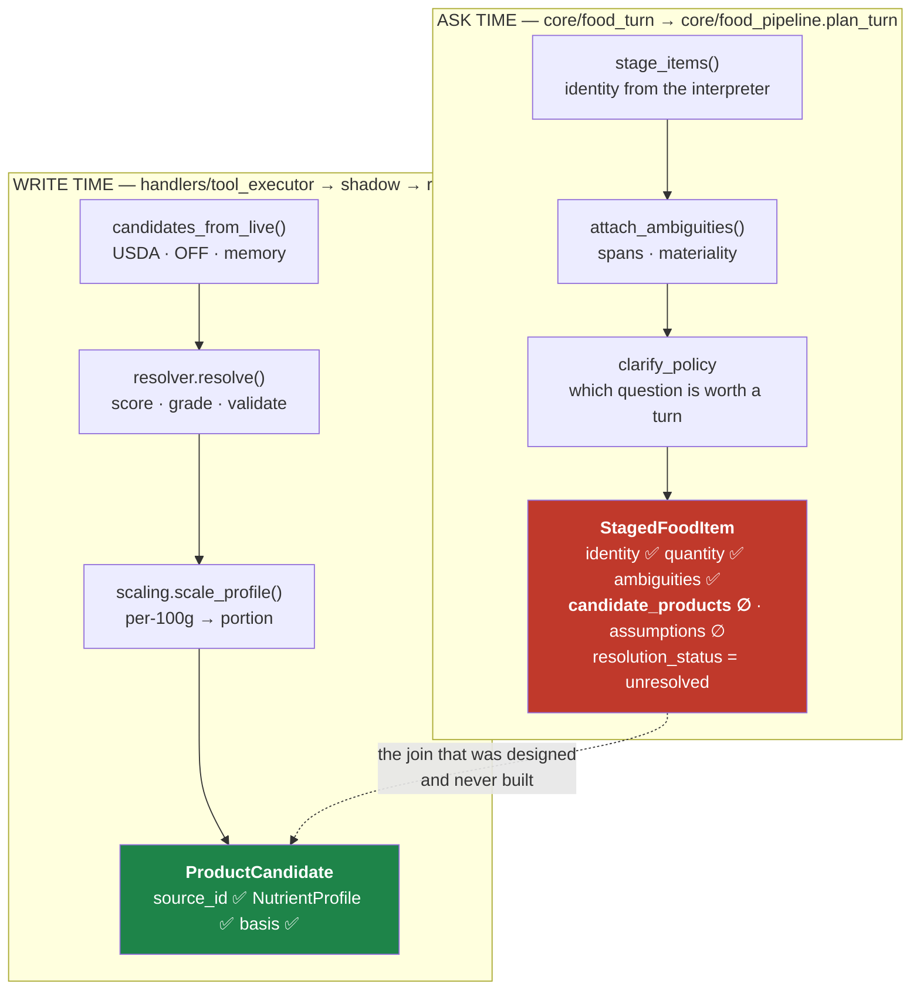

# Arnie architecture — the join that was never built

**Date:** 2026-07-30 · **Base:** `47e290d` · **Predecessors:**
[`ARCHITECTURE_AUDIT_2026-07-29.md`](ARCHITECTURE_AUDIT_2026-07-29.md) ·
[`FOOD_LANE_PLAN_2026-07-29.md`](FOOD_LANE_PLAN_2026-07-29.md)

The 07-29 audit closed with a list of questions only a production window could answer (its §9).
This one answers them, from **48 hours of live traffic read this morning**. Three of the plan's
conclusions invert.

**Evidence key:** `P` production data read 2026-07-30 04:10 UTC · `C` read from code at `47e290d` ·
`M` measured locally · `?` unverified

**Sample:** 231 turns / 48 h, 25 active users / 7 d, 199 turns carrying `reasoning_json`, of which
**73 are food-lane routed** `P`. Pendings: 110 rows / 72 h. `user_food_matches`: 740 rows.

---

## 0. The correction that reframes everything else

**The handoff and the plan both say "nothing is deployed". That is wrong, and has been for at
least a day** `P`. Production carries every deployment marker the branch introduced:

| Marker | Commit | In production? |
|---|---|---|
| `reasoning_json.route` | `f182b6e` | ✅ 73 rows |
| `pending_questions.payload_json.staged_items` | `cca96be` (cause A) | ✅ 6 pendings |
| `payload_json.log_date` | `47e290d` | ❌ 0 — committed 21:17 last night, not yet shipped |

So attribution, B, G and A **are live**, and the numbers below measure them rather than the
pre-sprint code. Every "closed" claim in the handoff is now testable, and two of them fail.

Deploys remain manual (`render.yaml` is reference-only; arnie-bot is dashboard-configured `C`),
which is exactly why the docs drifted from reality — nothing records that a deploy happened.
**Fix the record-keeping, not just the deploy:** a `/health` or startup log line carrying the git
SHA would make this question a query instead of an archaeology exercise.

---

## 1. The finding: two food worlds that never meet

`StagedFoodItem.candidate_products` — the field that carries a food's scored identity, its
`fdc_id`/OFF anchor and its per-100g basis — **has no producer anywhere in production code** `C`.
Every assignment to it is in a test or in the codec that reads it back.



The ask is composed **before anything is priced**, and the pricing is thrown away at the end of the
write. They are joined by nothing but the food's *name as a string*.

**This is the root the plan's causes A, B and F are each a symptom of:**

- **A** — "the ask carries a question, not the item". I fixed the *serialisation* (`e780c76`,
  `cca96be`) and it works: resolutions now persist and cross the turn boundary `P`. But what
  persists is identity + quantity + ambiguities and **nothing priced**, because at ask time nothing
  priced exists. Verified on live rows — see §2.
- **B** — "a correction relabels the row, it does not re-price it". It re-searches the mutated
  *string* because there is no resolved object to apply a typed change to. Same missing join.
- **F** — "memory models trust, never identity". `user_food_matches` is a **third** representation
  of food identity, with its own rules, agreeing with neither of the other two.

Three representations of "what food is this", one per stage, none authoritative. Every cause in the
plan that survives is downstream of that.

---

## 2. Cause A is live, and roughly half inert — measured

Six pendings carry `staged_items` `P`. Every one of them:

```
id=1986 u=26  name='Parmesan cheese'                      candidates=0  anchor=None
id=1980 u=26  name='Broth-based vegetable soup w/chicken' candidates=0  anchor=None
id=1975 u=5   name='Chicken soup'                         candidates=0  anchor=None
id=1985, 1974, 1970                                       staged_items=0
```

`resolution_status: "unresolved"` · `candidate_products: null` · `assumptions: null` `P`.

What that means concretely:

| Half of A | Status |
|---|---|
| The stored **identity** reaches the answer turn and is stated as settled | ✅ working — this is the anti-"Dollar pizza" guard |
| The stored **pricing** reaches the answer turn | ❌ nothing to store; `_held_line` never prints "we priced this at N cal" |
| The zero-lookup commit (`FOOD_ANSWER_APPLY`) | ❌ **unreachable** — `_best_candidate()` returns None on every row, so it declines 100% of the time even with the flag on |

I shipped that shadowed behind a default-off flag, which was the right call for a different reason
than I gave: it is not merely unproven, it is currently incapable of firing. **Three of six asks
stored zero items at all** — the "other ask return points store empties" path the code comments
predicted `C`.

This is this project's recurring failure mode — capability built, not reached — and I reproduced it
while fixing three instances of it. The lesson generalises: **`e780c76`'s round-trip tests all
passed because they constructed their own candidates.** A test that builds its own input cannot
discover that production never builds one. The missing check was a test asserting that a
*pipeline-produced* staged item carries what the codec claims to carry.

---

## 3. Cause G is deployed and does not work — 62 duplicates

The handoff lists G as closed by `32dcb36` ("one open question, one record"). `32dcb36` is an
ancestor of the deployed `cca96be`, so it is live. Production, last 7 days `P`:

**62 cross-kind pending pairs with byte-identical question text, written 2–11 seconds apart.**

```
u=26 gap=11s  "Quick one so it's clean, how much of the crust did you actually leave "
u=26 gap= 6s  "how many almonds, roughly a handful or a specific amount like 1oz?"
u=26 gap= 3s  "Quick one so it's clean:\n1. **Toast**: how many slices, and any butter"
u=26 gap= 2s  "Locking this in:\n1. **1 bar (55g) Barebells Salty Peanut Protein Bar**"
```

Kinds over 72 h: `conversation_hook` 67 · `food_structured_ask` 43 `P`. The hook layer still writes
its own copy of every question the food lane asks, with its own lifecycle — the exact defect G
described, at higher volume than the window that motivated the fix (which saw 2 of 5).

`32dcb36` made the *structured* record authoritative and able to chase. It did not stop the second
record being written. **A cause is not closed until production says so** — and nothing in the
branch's test suite could have caught this, because the duplicate is produced by a different
subsystem than the one the tests exercise.

---

## 4. The escape did not close, and its reason is now visible

The plan's §2.1 hoped legacy writes were trending to zero (0 of 7 in the last post-fix hour), with an
explicit caveat that the sample was 14 events. The caveat was right.

**Like-for-like — ledger events from a `legacy*` source:**

| Window | legacy* / total | share |
|---|---|---|
| 07-28/29, whole window `P` | 16 / 41 | 39 % |
| 07-28/29, after the Day-4 commits `P` | 4 / 14 | 29 % |
| **07-29/30, 48 h, deployed** `P` | **73 / 193** | **37.8 %** |

Essentially unchanged. Target is 0.

**A different, also-true cut — turns routed to the legacy *lane*** (n=73 food-lane turns) `P`:

| lane | n | share |
|---|---|---|
| **legacy** | **38** | **52.1 %** |
| structured_log | 21 | 28.8 % |
| structured_ask | 7 | 9.6 % |
| structured_update | 5 | 6.8 % |
| structured_delete | 2 | 2.7 % |

These two numbers measure different things (events vs turns) and must not be quoted as one.

**What the attribution work bought — the reason, which was the whole point of `f182b6e`** `P`:

| `legacy_reason` | n |
|---|---|
| **`interpreter_none`** | **25** |
| `mixed_domain` | 7 |
| `question` | 3 |
| `future_plan` | 3 |

**`interpreter_none` is two thirds of all escapes.** I first read that as "the interpreter is
failing on real food messages". **Reading the 25 raw messages says otherwise, and they split about
evenly into two different bugs** `P`:

**(a) Non-food turns the food gate admitted — ~11 of 25.** Legacy owns workouts, body weight and
walks, so falling through is the *correct outcome*; the cost is that each one paid a full
interpreter round trip first, 5–8 s, to produce nothing:

```
u=26   5544ms  'Mark my Flat DB complete coach 💪'
u=26   5547ms  '30x14x3 low to high fly just added'
u=26   8580ms  'Make sure you log those incline sets you didn't call the tool'
u=26   6227ms  '8 and 5 body weight'
u=26   8675ms  'Log my walk though'
u=26   5542ms  'Log my weight'
```

This is a **latency and spend** defect, not a correctness one — and it is the direct cost of
`FOOD_GATE_MODEL=true` plus the open-gate philosophy. It is also a large slice of §5's flat p50.

**(b) Genuine food turns that fell out of the structured lane — ~10 of 25.** These are the ones that
matter, and they are overwhelmingly **corrections and clarification answers**:

```
u=5   10168ms  'Update the sun chips to just 9 chips please'
u=5    7503ms  'I only had 9 individual sun chips'
u=26  11527ms  'Okay make that 3/4 of that cube lol'
u=26  10168ms  'Make sure the caramel cashew ones calories are right'
u=26  13310ms  'It's the same one'
u=5   19210ms  'I'm not I drank about 36fl oz'
u=26   5455ms  '[Photo received] [PREPARED_MEAL_AMBIGUOUS] Bowl of vegetable soup...'
```

That is causes **B** and **A** leaking, one layer up from where the plan looked for them: not
"the correction re-priced badly" but "**the correction never reached the structured lane at all**".
`"It's the same one"` is an answer to a clarification — precisely the turn A exists to serve — and it
routed to legacy. The photo line is notable too, given the photo lane was declared closed
(`5f0e195`).

The remaining ~4 are noise (`[REGENERATE:8292]`, `'Accidentally sen that my bad'`, `'[Voice note]: you'`).

**Two separate pieces of work, and (b) is the one that changes user-visible behaviour.** Neither
existed as a known issue yesterday; both are visible only because `f182b6e` recorded the reason.

---

## 5. Latency did not improve

| Metric | 07-28/29 `P` | 07-29/30 `P` |
|---|---|---|
| p50 | 7.0 s | **7.8 s** |
| p90 | 12.5 s | **13.1 s** |
| p99 | — | 20.3 s |
| max | 16.2 s | 22.9 s |

n=199 vs n=36, so the new figure is the more trustworthy one; the honest reading is
**"flat to slightly worse, on a much better sample"**, not a proven regression. The 07-29 audit's
latency wins are all `M` (local probes) and remain unconfirmed end-to-end `?`.

Note the interaction with §2: A was supposed to remove the slowest turns by making an answer a
zero-lookup commit. It cannot, because there is nothing stored to commit from.

---

## 6. Smaller, verified

- **The suite is not a reliable gate.** `tests/test_enrichment_prewarm.py::test_prewarm_runs_
  concurrently_not_serially` fails under full-suite load and passes 5/5 in isolation `M`. A
  timing assertion competing with the rest of the suite for CPU. Every "full suite green" claim in
  this sprint — mine included — carries that asterisk.
- **`route` is a nested dict**, `{lane, owner, legacy_reason}` `P`, not the flat `route_owner` the
  07-29 audit's §9 implies. Anyone querying the documented field gets an empty histogram (I did).
- **`route_owner`** is populated inside that dict — `gate_regex` dominates the sampled rows, `prior`
  and `thread` appear. The S2 question ("do we pay for two decision calls?") is now answerable and
  worth one query.
- **4 food entries in 7 days have 0 or NULL calories** `P` — small, but each is a row on a user's
  board that contributes nothing.
- **1 of 740 `user_food_matches` rows exceeds 900 cal/100 g** `P`. The write-side ceiling
  (`78463d0`) is deployed and holding. It cannot catch the cucumber-class defect (179 cal/100 g),
  which is F's real target and still unaddressed.
- **`food_clarification`** appears as a third pending kind alongside the two G names `P`.

---

## 7. Unmerged work, ranked by what it unblocks

| Branch | State | Why it matters |
|---|---|---|
| `dvoskin/food-eval-harness-and-four-defects` `d3345d1` | **not merged, not pushed** | The battery was scoring a materiality engine production does not run — the eval user has no body stats, `compute_macro_targets` raises, `_daily_targets` is None, and the legacy absolute thresholds get scored instead. **Every historical score, including the "20/20", is void.** Also makes the battery serial with `EVAL_REPS=3`, and fixes four real defects it had been hiding. |
| `dvoskin/food-turn-voice-and-receipt-fix` | 1 commit ahead | unreviewed |
| `dvoskin/composites-component-estimate` | 1 commit ahead | the plan's carried backlog (`40d4d9b` / `e4d651d`) |

The eval branch should land before anything else is measured against the battery. It is the
instrument, and the instrument is currently reading the wrong engine.

---

## 7b. Composite dishes — an engine built twice, a label that lies, and no way to verify it

Raised by Danny, and the audit supports it: composite logging has never been figured out or checked
for accuracy. Here is what is actually true today.

### The label already claims work that does not happen

`component_estimate` is not an engine. It is a **string** assigned here `C`:

```python
rung = "component_estimate" if food_class is authority.FoodClass.RESTAURANT else "estimate"
```

— and `authority.py:439` renders it to the user as **"Estimated from its components"**, under a
docstring that says the line "must be true (§7)". Nothing decomposes anything. The only difference
between that sentence and "Best estimate from the description" is a class check. This is cause H's
family — asserting something that did not happen — sitting in the provenance layer, where it is
*less* falsifiable than in prose because it looks like a citation.

### Composites are a small share of rows and a large share of calories

30 days of production `P`, dish-word match excluding branded rows (`Quest … Chili` is not a stew):

| | entries | share | mean cal | calorie share |
|---|---|---|---|---|
| composite | 71 | 8.4 % | **422** | **17.0 %** |
| simple | 771 | 91.6 % | 190 | 83.0 % |

**One row in twelve, one calorie in six.** Being systematically wrong here moves the day's total more
than being wrong anywhere else. The name match is a heuristic and the split is soft at the edges `?`.

### Accuracy is not verifiable from user behaviour — this is the crux

The obvious proxy is "do users correct composites more often?" On a properly matched population `P`:

| | update events / entry | entries ever corrected |
|---|---|---|
| composite | 0.042 | 1 of 71 (1.4 %) |
| simple | 0.042 | 22 of 771 (2.9 %) |

**Identical.** *(An earlier cut of this query showed composites corrected 2× more often; that was an
artifact of joining across an unmatched entry population, and it is wrong. The matched numbers are
above.)*

One composite corrected in thirty days is not evidence that composite pricing is good. It is
evidence that **a wrong composite does not look wrong**. Nobody can eyeball whether a CAVA Spicy Lamb
Bowl is 680 calories; they can absolutely tell that one banana is not 8 grams of protein. So the
correction signal that makes simple-food errors self-reporting is **structurally absent** here.

The consequence for planning: composite accuracy **cannot be measured from production, ever**. It
needs external ground truth. That is why this has stayed unfigured — not because nobody tried, but
because the usual feedback loop does not exist.

The one accuracy number that does exist is a self-consistency failure, from `b835700`: composite
totals **drift 18–21 % across logging modes** `C` — the same dish priced differently depending on
mode, which is wrong regardless of what the truth is.

### The engine is built. Twice. Neither is merged.

| Branch | Design |
|---|---|
| `40d4d9b` (`claude/open-issues-composites-stall-usda`) | 642-line `composites.py`, gold USDA row fixtures, 437-line test. Recipe and masses are **ours** and disclosed as assumptions; the nutrition is **theirs** (USDA generics). Answers a **range**, not a point, because summing typical masses would claim measurement confidence a dish has not earned. **Fails closed** — a recipe whose required parts cannot all be priced seats nothing. A test starves the module of rows to prove no calorie figure is hardcoded. |
| `e4d651d` (`dvoskin/composites-component-estimate`) | 462-line variant + `components_could_win()`; seats component candidates on the **GENERIC** ladder too, because `classify()` sends "two carnitas tacos" to GENERIC, not RESTAURANT — a rung living only on the restaurant ladder answers none of them. Also deletes the false relabel. |

Both diagnose exactly the lie described above. The plan's carried backlog already says: adopt
`40d4d9b`, graft `components_could_win()` from `e4d651d`.

### The gap neither branch closes: the library does not match the traffic

Recipe keys are taco- and burger-shaped — al pastor, asada, barbacoa, carnitas, birria, quesadilla,
hamburger, poke, falafel, chipotle bowl `C`. Grepping both libraries for the dishes production
actually logs `C`:

| dish | in `40d4d9b` | in `e4d651d` |
|---|---|---|
| **pizza** | ❌ | ❌ |
| stew | ❌ | ❌ |
| sushi | ❌ | ❌ |
| shawarma | ❌ | ❌ |
| pasta / curry | ❌ | ❌ |
| salad | partial | ❌ |

The real composites logged in the last 30 days `P`: *Dollar pizza slices* ×2, *Cheese pizza, NY-style
thin crust*, *Detroit-style pepperoni pizza*, *Caesar Salad*, *Beef stew with mashed potatoes*,
*Ground beef and eggplant stew*, *Arugula, avocado, onion salad*, *Vegetable roll (sushi)*, *CAVA
Spicy Lamb Bowl*, *shawarma platter*, *Chicken burrito bowl*, *Fish taco*.

**Pizza is the most-logged composite and neither library has a pizza.** The engine would ship,
correctly, and decline nearly everything this user base eats — fail-closed turning a correctness
virtue into total silence. That is the same shape as the food gate that shipped switched off.

### What "verified for accuracy" has to mean here

A build-out plan, since none exists:

1. **Seed the library from the traffic, not from intuition.** Rank the last 90 days of composite
   names by calorie contribution and write recipes down that list. Pizza, bowls, salads and stews
   before another taco variant.
2. **Decide per dish whether decomposition is even the right tool.** The branches' thesis — "USDA has
   no taco, but it has tortillas and pork" — is true for assembled-to-order food and questionable for
   dishes that already have a curated prepared-food row. Settle it with evidence: for each top dish,
   compare a direct row against the decomposition `?`. Decomposition should be the **fallback when no
   good direct row exists**, not a replacement for lookup.
3. **Build a ground-truth corpus, because production cannot supply one.** Restaurant published
   nutrition (CAVA, Chipotle and similar publish per-item), plus curated prepared-dish rows. Perhaps
   30–50 dishes with a known answer.
4. **Score it on two axes, and report both.** *Coverage*: does the returned range contain the truth?
   *Accuracy*: point-estimate error on calories **and protein** — protein separately, because the
   whole lane exists for protein and a calorie-only score has hidden protein errors before
   (`PR #31`). A range that always contains the truth by being enormous is not a pass.
5. **Fix the 18–21 % mode drift first or measure it as part of the score.** One dish must price the
   same in quick and strict; only the *question* asked about it should differ.
6. **Only then delete the false label.** Until the engine is seated, "Estimated from its components"
   should say "estimate" — that is a one-line honesty fix that need not wait for any of the above,
   and `e4d651d` already contains it.

---

## 8. What to do next

Ranked by *evidence that it is broken in production now*, which is the only ranking that has held up
across these three audits.

1. **Merge the eval harness** (`d3345d1`). Everything below is scored with it. Half a day.
2. **Corrections and clarification answers falling out of the structured lane** — §4(b), ~10 turns
   in 48 h. `"Update the sun chips to just 9 chips please"`, `"It's the same one"`,
   `"Okay make that 3/4 of that cube lol"` all reached legacy. This is the most user-visible defect
   the audit found, it is causes A and B one layer higher than the plan looked, and the failing
   turns are already enumerated — start by reproducing those exact messages through the lane.
3. **Stop paying an interpreter round trip for workout and body-weight turns** — §4(a), ~11 turns in
   48 h at 5–8 s each. The gate admits them, the food interpreter returns nothing, legacy handles
   them correctly. Cheap latency and spend win; no correctness risk, because the destination does
   not change.
4. **Stop the duplicate pending write (G, properly).** 62 exact duplicates in 7 days. Find the hook
   writer, make it reference the structured ask instead of copying it, and assert the invariant
   against the **database** rather than against a unit under test.
5. **Build the join (§1)** — one resolution object, produced once, read by the ask, the write, the
   correction and memory. This is the real cause A/B/F fix and it is a genuine piece of
   architecture, not a patch. Concretely, the first step is small and testable: have `plan_turn`
   attach the resolver's candidates to the staged item, so `candidate_products` stops being empty.
   That alone makes A's stored resolution real and lets `FOOD_ANSWER_APPLY` actually fire.
6. **Add the missing class of test**: a pipeline-produced staged item must satisfy what the codec
   and the answer path assume of it. §2 is the standing example of what its absence hides.
7. **De-flake `test_prewarm_runs_concurrently_not_serially`** or mark it non-parallel. Until then no
   green-suite claim means what it says.
8. **Put the deployed SHA somewhere queryable.** §0 cost an hour of inference that a log line would
   have answered.
9. **Composites (§7b)** — a workstream, not a task, and the only one here whose accuracy cannot be
   scored from production. Sequence it as: the one-line honesty fix (stop saying "estimated from its
   components" when nothing was) → seed the recipe library from the traffic's own calorie ranking →
   ground-truth corpus → adopt `40d4d9b` + `components_could_win()` behind a flag → score coverage
   and per-macro error → then seat it. **Do not merge the engine before the library matches the
   traffic**: it fails closed, so today it would ship correct and silent.

**Where composites sit against the rest:** the honesty fix is worth doing immediately — it is one
line and it stops a false provenance claim. The engine itself should follow item 5 (the join),
because a composite is the case that most needs one resolution object: its parts are priced at write
time, its ambiguities are asked at ask time, and today neither can see the other.

Then the plan's remaining causes — **F** (identity, now correctly understood as needing §1 first),
**E** (locale, still unmeasured here), **C**, **D** as a re-measure.

**Not recommended yet:** throwing `FOOD_ANSWER_APPLY`. It cannot fire (§2), and turning it on before
step 4 would only mean it starts declining loudly instead of quietly.

---

## 9. What this audit could not settle

- **Why the food corrections in §4(b) return `interpreter_none`** — the messages are known, the
  mechanism is not `?`.
- **Whether the duplicate hook has a single writer** or several `?`.
- **RU/locale (cause E)** — not sampled here; the 07-29 window found 2 of 6 users affected `?`.
- **`route_owner` shares** — collected, not yet cut into the S2 answer `?`.
- **Whether latency moved for a reason or with the traffic mix** `?`.
- **Composite accuracy, at all** `?` — and unlike everything else on this list, no production window
  will answer it (§7b). It needs a ground-truth corpus that does not yet exist. The composite share
  of calories (17 %) is a name heuristic and soft at the edges.
- **Whether decomposition beats a direct prepared-dish row** for pizza, Caesar salad and the other
  top dishes `?`. Assumed by both branches, tested by neither.
