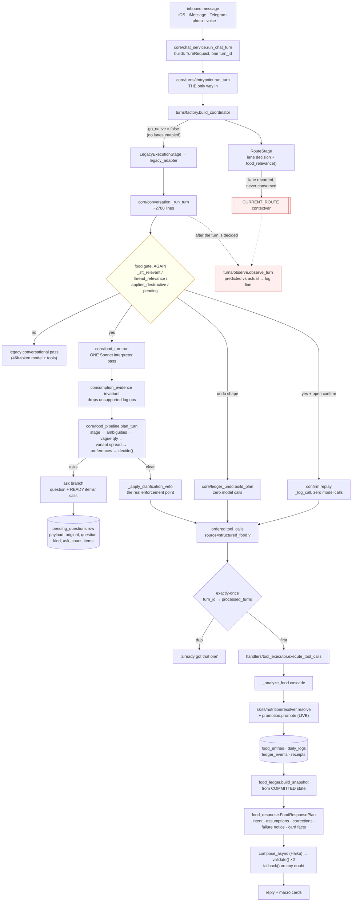
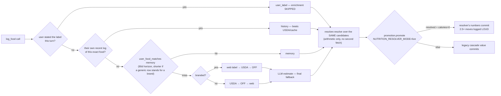
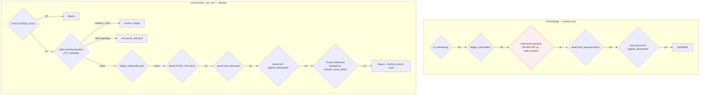
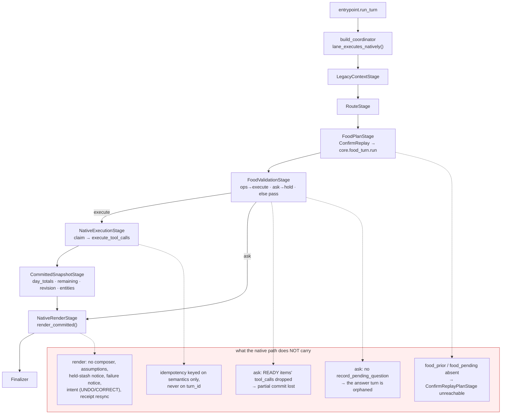
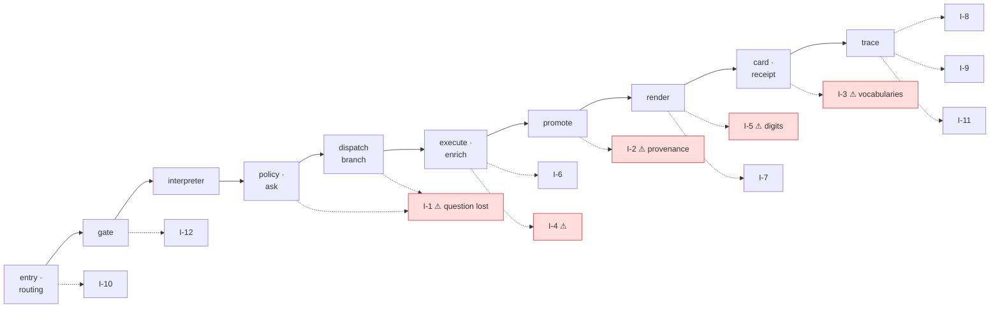

# Arnie nutrition lane — structured audit

**Date:** 2026-07-28 · **Base:** `13df170` (branch `dvoskin/arnie-nutrition-lane-audit-c5debc`, clean)
**Carried forward to:** `a1c26d3` — §§1–9 are the audit as first written and re-audited at `e52fad9`; **§§10–16 bring it current**. §1's `NUTRITION_RESOLVER_MODE` row has been corrected in place. Where an early section and a late section disagree, the late one is the deployed truth.
**Scope:** everything a food message touches — routing, interpretation, clarification policy, execution, nutrition resolution, rendering, observability, rollout controls, tests.

Method: read the live path end to end (`core/chat_service` → `core/turns/*` → `core/conversation` → `core/food_turn` → `core/food_pipeline` → `handlers/tool_executor` → `core/food_ledger` / `core/food_response`), reachability-swept all 42 `skills/nutrition/*` modules against production importers, and ran the food/nutrition/meal test subset twice.

---

## 1. Deployed configuration

From `render.yaml` plus in-code defaults. This is the single most load-bearing table in the audit — most of the lane's behaviour is a flag.

| Flag | Value | Default | Effect |
|---|---|---|---|
| `STRUCTURED_FOOD` | *(unset)* | `true` | The structured lane is on |
| `FOOD_GATE_MODEL` | `true` | `false` | Haiku decides food-vs-not for what the regexes miss |
| `FOOD_GATE_OPEN` | *(unset)* | `false` | Deliberate — alternative to the model gate, not a companion |
| `FOOD_PIPELINE` | *(unset)* | `true` | Staged-item ambiguity engine on |
| `FOOD_COMPOSER` | `true` | `true` | Haiku phrases the approved plan |
| `NUTRITION_RESOLVER_MODE` | `live` **in `render.yaml` only** | `shadow` | **CORRECTED — see §16 / O-2.** The value is declared but is not in the deployed environment: every production turn logs `cohort=shadow`. The resolver has **never owned a committed number**. The row previously read "Resolver owns committed nutrients, all users" — that was read off the file, not off a turn. |
| `TURN_COORDINATOR_MODE` | `new_observe` | `legacy_only` | Coordinator routes and records; legacy executes |
| `TURN_COORDINATOR_LANES` | *(unset)* | — | No lane runs natively |
| `TURN_COORDINATOR_OBSERVE_DEEP` | *(unset)* | off | **Disposition agreement is never measured** |
| `FOOD_FAST_PATH` / `_SHADOW` | *(unset)* | `false` / `false` | Zero-model-call parser is off **and unmeasured** |
| `FOOD_ASK_TTL_MIN` / `FOOD_CONFIRM_TTL_MIN` | *(unset)* | `240` / `20` | Flat pending expiry |

Notable: the canary machinery in `skills/nutrition/canary.py` (deterministic buckets, halt latch, readiness-gate evaluation) is fully built, and `NUTRITION_RESOLVER_CANARY_PCT` is unset — so *were the mode actually live*, `owns_committed_values()` would fall to `return not allow` with an empty allowlist, i.e. 100% live with no control group. **That is not the deployed state.** Production logs `cohort=shadow` on every turn, which means the opposite failure: the resolver computes a number, records the comparison, and then does not own the row. Both readings were in this document at different times; the deployed one is `shadow`. Deciding between them is O-2 in §16.

---

## 2. The flow as it actually runs today



### The enrichment cascade inside `_analyze_food`



### Routing decision order (live)

Two independent routers run per turn and only one of them decides.



The two disagree by construction on exactly the cases the coordinator most needs to model — see finding **B1**.

---

## 3. The planned flow, and what is missing to get there

Promotion is meant to be `TURN_COORDINATOR_MODE=new_execute` + `TURN_COORDINATOR_LANES=structured_food` (+ optional allowlist). `build_coordinator` then swaps in `FoodPlanStage` / `FoodValidationStage` / `NativeExecutionStage` / `CommittedSnapshotStage` / `NativeRenderStage`, and `core/conversation._run_turn` is never called for the lane.



**Promoting the food lane today would be a functional regression**, not a no-op. Each gap is small and local; none is architectural.

---

## 4. Findings

Ranked by consequence. Every one is verified against the code, not inferred from comments.

### A — Native lane loses behaviour the legacy lane has (promotion blockers)

**A1. An ask discards its partial commit.**
`core/turns/stages/food.py:60` returns `TurnPlan(operations=(), ...)` for `action == "ask"`. But `core/food_turn.py:3046` and `:2871` both return an ask *with* `tool_calls` — the READY items the veto cleared. Legacy executes them (`core/conversation.py:1177`); native drops them. Moderate mode's PARTIAL_COMMIT contract silently becomes ATOMIC_HOLD — the exact bug `core/conversation.py:1150-1162` documents having already fixed once.

**A2. An ask never records its pending question.**
`record_pending_question` is called only in `core/conversation.py:993`. `NativeRenderStage` returns the clarification text and `Finalizer` logs a line. Under `new_execute` the question ships and the user's answer arrives cold — no `prior`, no `ask_count`, no stashed items. The clarification loop does not close.

**A3. Native rendering is a strictly weaker renderer.**
`core/turns/stages/render_native.py:101` calls `food_ledger.render_committed(narration_hint, "", "", snap)`. The legacy path (`core/conversation.py:1891-2106`) builds a `FoodResponsePlan` carrying intent (UNDO/CORRECT/COMMIT), before→after corrections, named assumptions, the failure notice, card-recitation facts and the held-item notice, then runs the composer with double validation. Promoting the lane turns off all of it, including the fix that stopped a correction announcing itself as a fresh log.

**A4. `food_prior` / `food_pending` are never put on the request.**
`core/turns/entrypoint.build_request` (`:54-60`) sets `db`, `user`, `today_log`, `in_onboarding`, `has_board` — and nothing else. So `RouteStage`'s `pending_clarification` branch (`route.py:36`) and `ConfirmReplayPlanStage` (`deterministic.py:83`) can never fire on the live path. The only caller that passes them is the shadow-observation hook, whose values are then ignored (**B1**).

**A5. Divergent exactly-once semantics.**
Legacy prefers the canonical transport identity: `_ikey = turn_id or _ik_fn(...)` (`conversation.py:1097`). `NativeExecutionStage._claim` (`execute_native.py:70`) always computes the semantic fingerprint. The distinction is the one `FOOD_LEDGER_V2` Phase 2 was explicitly built for — a transport retry vs. the user genuinely re-sending the same words.

### B — The promotion gate measures the wrong thing

**B1. Observed route is computed without the metadata that decides the hard cases.**
`observe.observe_turn` reads `CURRENT_ROUTE` (set in `entrypoint.py:81` from the factory's route) rather than routing the enriched request it is handed. That route was computed with no `food_pending`, so every answer turn and every confirm reply is predicted from `food_relevance(text)` alone — "half of it", "the big bag", "yes" — while legacy routes them structured via the pending question. The agreement rate that gates the rollout is biased against precisely the turns the native lane is least ready for.

**B2. Disposition agreement is effectively never measured.**
`deep_observing()` defaults off and `TURN_COORDINATOR_OBSERVE_DEEP` is unset in `render.yaml`, so `agree_disp` short-circuits to `True` for the food lane on every turn. The observe line is a lane-agreement metric wearing a disposition-agreement name.

### C — Built, tested, and dark

**C1. The deterministic answer parsers can only ever parse commands.**
`core/food_turn.parse_prior_answer` needs `prior["response_schema"]` to dispatch (`:2574`). The ask returns `response_schema`, `question_id`, `staged_item_id`, `requested_fields`, `options` and `meal_group_id` (`food_turn.py:3049-3067`) — and `conversation.py:1004` persists only `original`, `question`, `kind`, `ask_count`, `items`. So `parse_answer` returns `None` before it ever reaches `PARSERS`, the answer turn re-runs the whole interpreter, and the staged item the question was bound to is lost. `parse_command` still works (it needs no schema), which is why "skip it" behaves and "about a cup" does not. **This is the same class of bug the function's own docstring says it was written to fix.**

**C2. `skills/nutrition/pending_store.py` — 355 lines, zero production importers.**
Three expiry windows (active / recoverable / stale), the logical meal *date*, and a compare-and-swap consume so two rapid answers cannot both apply. Live behaviour is instead a flat TTL in `food_ledger.pending_expired` (240 min clarify / 20 min confirm) with no CAS. The race it was written for is live today.

**C3. `MealResolution` is documented as the sole authority for what landed and is called from nowhere.**
`food_pipeline.build_meal_resolution` → `meal_resolution.build_resolution` → `food_response.plan_from_resolution` form a complete chain with no production caller. `conversation.py` re-derives committed/failed from `_execution` inline instead.

**C4. `_approved_operations` reports; it does not gate.**
`food_pipeline.py:473` filters `data["_calls"]`, which the live interpreter JSON never carries — its own docstring says so. Real enforcement is `food_turn._apply_clarification_veto` against constructed calls. Correct today, but the staged-pipeline API advertises an approval it cannot enforce, and the coordinator's food stage is one of the callers that *does* hold calls at decision time.

**C5. Trace coverage is 5 of 7 stages.**
`Stage.INTERPRET` has no `record()` or `stage()` call site anywhere; `Stage.PROMOTE` is only ever a `note()`. So the funnel cannot answer "how many turns died in interpretation" — the largest single block in a food turn.

**C6. `component_estimate` is a label with nothing behind it.**
`skills/nutrition/authority.py:74` seats it on the RESTAURANT ladder; the only writer is `food_intelligence.py:839`, which relabels *the model's own estimate* when a supplementary source didn't supply macros. No decomposition, no per-component USDA pricing. Composite dishes are the model's guess wearing a provenance badge. (Matches `docs/SESSION_0727_HANDOFF.md` §1 — still unstarted.)

### D — Cost and latency

**D1. A single food turn can spend four model calls.** Gate (Haiku, `food_relevance`) → interpreter (Sonnet, `_logger_model`) → optional variant lookups (`_variant_spreads`, `_variant_options`) → composer (Haiku). Only the interpreter is inside a stage that reports its own timing.

**D2. The gate now runs on every turn, food or not.** `RouteStage` awaits `food_relevance` for all traffic. It is currently free because `_RELEVANCE_CACHE` is keyed on the normalized text alone and the `last_assistant` parameter was deliberately neutered (`food_turn.py:534`, `asked = False`) — so the coordinator's call and conversation's call hit the same key. If that parameter is ever re-enabled without also threading it into `RouteStage`, the cache splits and the cost doubles.

**D3. The zero-model-call fast path is off and unmeasured.** `FOOD_FAST_PATH=false`, `FOOD_FAST_PATH_SHADOW=false`. `_log_fast_path_shadow` exists precisely to produce the disagreement rate that would justify enabling it, and nothing is emitting it. It is also gated to `not prior and not thread_active and not board` — i.e. it can only ever fire on the first meal of the day.

### E — Test health · **CORRECTED — this finding was my measurement error**

First measured on this worktree's base (`13df170`): 10 stable failures + 3 that flapped, all green in isolation. I reported that as cross-file state leakage.

It is — and **it was already fixed 18 minutes after this worktree was cut.** `main` is 3 commits ahead; `7643816 fix(tests): the suite answers about the code, not about the directory` makes `tests/conftest.py` hermetic by neutering `dotenv.load_dotenv` (which `main.py` calls with `override=True` **at import**, so a developer `.env` was setting `FOOD_GATE_MODEL`, `TURN_COORDINATOR_MODE` and live API keys for the suite) and by pinning `DATABASE_URL` to in-memory. Its own commit message records the same measurement I made: *"2 failures in a clean worktree, 21 to 34 in one holding a developer `.env` and an `arnie.db`. Both counts STABLE across repeated runs, which is what made it expensive — it never presented as flakiness."*

That is exactly the trap I walked into: this worktree sits under `/Users/danielvoskin/Code Learn/arnie/`, whose `.env` `find_dotenv` walks up to. Re-measured with `main`'s conftest, same source otherwise:

```
pytest tests/ -k "food or nutrition or meal"   →  FAILED_COUNT = 0
```

**E1–E3 are withdrawn.** The suite is a gate; it had two doors propped open, and they are shut on `main`. The action is to rebase, not to investigate.

**E4 stands** (renumbered from E3, and independent of the above): `test_the_model_gate_falls_back_to_the_regexes_on_failure` patches `FT.chat`, but `food_relevance` does a function-local `from core.llm import chat` (`food_turn.py:543`) that shadows the module attribute. Verified directly: with `FT.chat` patched to raise, the real client is still constructed and dispatched. The production fallback is correct — the `except` catches it — but it has **no working test**, and `render.yaml` documents `FOOD_GATE_MODEL=true` as safe to throw *because* that fallback is verified.

**Base note.** Everything else in this audit was re-checked against `main`. The only source file `main` changes is `handlers/tool_executor.py` (`d57f068`, which lifts the lookup out of `_analyze_food` into a separate evidence-gathering function — "Lifted out unchanged"). Confirmed against `main`'s copy: the log branch's `inp` sync, the two `_stash_receipt`/`_stash_sourcing` call sites, the `lanes` stash, and the update branch's write-`changes`-only behaviour are all unchanged, so **I-2, I-3 and I-4 stand on `main`**. I-1, I-5, T-2, C1, T-1a and T-1b live in `conversation.py`, `food_response.py` and `promotion.py`, which `main` does not touch at all.

---

## 5. Verified against a production transcript (IMG_8855–8858, 11:33)

One meal, four turns, iOS. Every defect below is an instance of a finding above — except **T-1b** and **T-2**, which the static read missed.

```
U  Also have a legendary protein roll
A  Protein roll, 300 cal, 25g protein
   Total: 300 cal, 25g protein
   The protein roll is the whole entry here, so I need to nail it down. Was it a
   branded roll from a shop or bakery, or do you have the label handy? …
                                                    → ASK. nothing logged. no card.

U  Its from a brand called Legendary Foods
A  Looking it up.
   Legendary Foods roll, 210 cal, 20g protein per the label, better than my
   generic guess.                                   → still nothing logged. no card.

U  Yeah let's log that
A  ✓ Logged · "You've got solid room to work with…"
   [card] Legendary Foods Roll (1 roll) · 210 cal · 20g protein
          1,215 cal left · 128g protein to go
          Protein 20g · Carbs 24g · Fat 0g · Fiber 6g · Sodium 251mg
   [receipt] Searched for Legendary Foods Roll
             Nothing for this in USDA food database or the product label on the web
             From the product label
             Serving checked — 1 roll
             Logged Legendary Foods Roll — 200 cal, 13g protein

U  Wrong food it's a legendary food protein sweet roll milk choc
A  ✓ Updated your log
   Swapped the roll to the cookies and cream version.
                                                    → no card. stale card above stands.
```

### T-0 — the gate did its job

`applies("Also have a legendary protein roll")` is `False` (verified): "have" is in neither `_EATEN_RE` nor `_CONSUMED_RE`, there's no meal word and no portion shape. The message reached the lane only because `FOOD_GATE_MODEL=true`. Everything below is downstream of a gate that is now working — which is why it is all newly visible.

### T-1 — three turns to log one roll (finding C1, plus a new cause)

**T-1a.** The brand answer at turn 2 could not be read as an answer. `parse_prior_answer` dispatches on `prior["response_schema"]`, and `conversation.py:1004` persists only `original`/`question`/`kind`/`ask_count`/`items` — so it returns `None` before reaching `PARSERS`, and "Legendary Foods" arrives at the interpreter as prose to re-read rather than as a settled field on the staged item. This is audit **C1**, in production.

**T-1b — NEW.** `conversation.py:1020` closes the pending question *unconditionally* whenever one existed — including on a turn where the interpreter returned `None` and the turn fell through to legacy, which is exactly what turn 2 is (a `web_search` reply with no `log_food`). The comment says "so it can never loop"; the cost is that **an answer the structured lane declined still closes the question**. Turn 3 therefore arrived cold, with no `prior` at all, and had to re-derive the item from `last_assistant`. The user paid three turns for one roll and never got the ask/answer contract the lane is built around.

### T-2 — the ask stated committed-looking macros for a turn that wrote nothing — NEW

"Protein roll, 300 cal, 25g protein / **Total:** 300 cal, 25g protein" — with no card, no write, and a day sitting near 800 cal, so "Total:" is not the day. It is the batch total of an item that never landed.

Every guard that should have caught it is inert on a clarification, and for one reason:

| guard | why it didn't fire |
|---|---|
| `validate()` → `PENDING_AS_COMMITTED` (`food_response.py:1021`) | iterates `plan.pending_items`, which `plan_clarify` (`:733`) never populates — verified `()` |
| `_recites_card_facts` | clarify plans carry `facts_visible_in_card=frozenset()` — verified |
| `_claims_it_landed` | needs a success verb near the name; a bare macro recital has no verb |

`pending_items` is populated in exactly one place in the codebase: `plan_from_resolution` (`:775`) — part of the dead `MealResolution` chain, **audit finding C3**. Verified end to end: `validate()` returns `ok` for this exact sentence against a real clarify plan.

So C3 is not merely unused structure. The one check standing between an un-committed item and a committed-looking number is fed by the only function nobody calls.

### T-3 — the receipt contradicts itself, and contradicts the card

**Source.** "Nothing for this in USDA food database or the product label on the web" sits directly above "From the product label". Two vocabularies that were never reconciled:

- `reasoning._SOURCE_DETAIL` is keyed by **lane** — `web_label` → "From the product label", `off` → "From the Open Food Facts label".
- `authority._MACRO_SOURCE_DETAIL` is keyed by **rung** — `branded_exact` → "From the product label".

`reasoning.py:126-127` lets the rung string *override* the lane string. So an Open Food Facts answer (lane `off`, rung `branded_exact`) is reported with the web-label sentence, printed underneath a line correctly stating the web-label lane found nothing. The honest string for that answer — "From the Open Food Facts label" — exists and is discarded.

**Numbers.** The card says 210 cal / 20 g; the receipt one line below says the write was **200 cal, 13 g protein**. `_stash_receipt` and `_stash_sourcing` both read the same `analysis` object (`tool_executor.py:2966`, `:2970`), so within a turn they cannot diverge — which means the card is bound to live entry state (note its `Edited` badge) while the receipt is frozen text from the original write. Two surfaces, two sources, no shared committed snapshot. `FOOD_LEDGER_V2` Phase 2 still lists "card + narration from the same snapshot" under *Remaining*; audit **C3**.

### T-4 — Fat 0 g, and nothing in the system can doubt it

20 g protein + 24 g carbs = 176 cal against a stated 210 — about 34 cal unaccounted, roughly 3.8 g of fat, on a chocolate sweet roll.

`reconcile_macros` cannot recover this. The rebalance is multiplicative (`fat = round(fat * scale, 1)`), so zero stays zero for any scale, and the `elif remaining > 0` branch that would place the residual only fires when carbs *and* fat are both zero. Verified:

```
reconcile_macros(210, 20, 24, 0) -> (210, 20, 32.5, 0.0)
```

The residual is pushed into carbs and the item stays fat-free. `sanity.check_values` bounds energy density from above only, so a too-low macro passes. **This is the butter-at-0-calories shape again** (`docs/SESSION_0727_HANDOFF.md`, `aad3416`): a zero that no layer is able to question. That fix addressed zero *calories*; zero *macros* has the same hole.

Second-order: the card shows carbs 24, not the 32.5 reconcile produces — so either reconcile never ran on the committed values, or the panel is rendering pre-reconcile numbers. Both are bugs; distinguishing them needs the row.

### T-5 — the correction invented a flavour and shipped no card

User said **milk choc**; the reply says **cookies and cream**. The re-resolution machinery is wired correctly — `tool_executor.py:3500-3523` re-runs the full ladder when `food_name` changes, and it is one of the better-guarded paths in the lane. What isn't wired is the same thing as T-1a: the user's stated variant travels as prose through a fresh interpreter pass instead of binding to a field, and the composer narrated a variant nobody said.

And the correction turn emits no card, so the only card on screen still reads "Legendary Foods Roll · 210 cal · Fat 0g" — the product that was just replaced. The user cannot see what their correction actually produced.

### What this transcript changes about the audit

Nothing is contradicted; two things are added (**T-1b**, **T-2**) and one finding is promoted. **C3 moves from "dead code, decide whether to adopt or delete" to a live correctness defect** — `plan_from_resolution` is the sole producer of `pending_items`, and its absence is why an un-committed item can be printed with a total. Deleting that chain without first re-homing `pending_items` would make the hole permanent.

---

## 6. Live-path trace — inconsistency register

A stage-by-stage pass over the path a food message actually takes, looking for one thing only: **two parts of the system that disagree about the same fact.** Each entry names both sides, the evidence, and what the user sees. Every claim below was executed against the code, not read off a comment.



### I-1 — An ask that partially commits loses its question · **dispatch** · critical

`conversation.py:1789` gates the structured render on `action in ("log", "update", "delete", "commit")`. `"ask"` is not in that tuple. But since the partial-commit release (`food_turn.py:2870`, `:3046`), an ask **carries `tool_calls`** — so:

- `:1282` → `tool_calls` = the ready items' `log_food` calls
- `:1742` → `has_logging = True`
- `:1775` → `elif has_logging and not in_onboarding:`
- `:1789` → structured block **skipped** (`action == "ask"`)
- `:2123` → `elif _pure_food:` — `_is_pure_food_log` returns True for a pure `log_food` batch
- → `response_text = _fast_voice or deterministic_confirmation(...)`

**The clarification question — already assigned at `:1272` — is overwritten by a legacy log confirmation.** And the pending question was recorded at `:993` regardless, so the user's next message is parsed as an answer to a question they were never shown.

It fires only on a mixed meal (some items ready, one held) — precisely the case the release was built for. Note the symmetry with **A1**: the legacy path keeps the writes and loses the question; the native path keeps the question and loses the writes. Neither does what `conversation.py:1150-1179` says the design is.

### I-2 — Promoted items carry two contradictory accounts of their own provenance · **promote** · critical

`promotion.to_food_analysis` routes through `analyze(...)` with **`usda_candidate=None, memory_match=None, web_candidate=None`** (`promotion.py:154-157`) — deliberately, so derived fields are computed by one code path — then overwrites `source`, `confidence`, `enrichment_source`, `fdc_id`. It never rebuilds `provenance`, which `analyze` has just computed from no candidates at all. Executed:

```
resolution: source="off", tier=BRANDED_EXACT, grade=EXACT
promoted analysis:
  .source                          = off          → receipt headline: "Found the product in Open Food Facts"
  .confidence                      = exact        → card badge: not estimated
  .provenance.rung                 = estimate
  .provenance.macros_are_estimated = True
  authority.display_detail(prov)   = "Best estimate from the description"
```

Three surfaces, three fields, three answers for one row: the receipt headline reads `.source`, the receipt detail line reads `provenance`, the card badge reads `.confidence`. This is live for **every food log** — `NUTRITION_RESOLVER_MODE=live`, empty allowlist, no canary percentage. `_stash_sourcing` also persists `provenance.as_dict()`, so the stored provenance record says `estimate` for exactly-matched branded rows, and `is_fallback` — the "a generic is standing in for a named product" disclosure — can never fire on a promoted item.

### I-3 — Four provenance vocabularies over three key spaces, with a silent default · **card/receipt**

| map | keyed by | keys |
|---|---|---|
| `reasoning._SOURCE_LABELS` / `_SOURCE_DETAIL` | **lane** | 6 — estimate, history, memory, off, usda, web_label |
| `authority._MACRO_SOURCE_DETAIL` | **rung** | 14 — branded_exact, usda_exact, usda_generic, portion_ontology, … |
| `provenance.TIER_BY_LABEL`, `promotion._CONFIDENCE_BY_TIER` | **tier** | 6 — user_label, user_regular, branded_exact, generic_exact, estimated, provisional |

`FoodAnalysis.source` legitimately holds values from the *candidate* space — `user_label`, `provisional`, `unresolved`, and the saved-regular label (`candidates.py:123`) — none of which the receipt's map contains. `_food_detailed` looks it up as `.get(source, _SOURCE_LABELS["estimate"])`. Executed:

```
history      OK   -> 'Found it in your own earlier log'
memory       OK   -> 'Found it in your saved foods'
usda         OK   -> 'Matched the USDA food database'
off          OK   -> 'Found the product in Open Food Facts'
web_label    OK   -> 'Found the product label online'
estimate     OK   -> 'Estimated from what you described'
user_label   MISS -> 'Estimated from what you described'
user_regular MISS -> 'Estimated from what you described'
provisional  MISS -> 'Estimated from what you described'
unresolved   MISS -> 'Estimated from what you described'
```

`user_label` is the tier where `_analyze_food` **skips enrichment entirely** because "no database outranks it" (`tool_executor.py:1714`). It reports to the user as a guess.

On top of that, `reasoning.py:126-127` lets the rung sentence override the lane sentence whenever they differ — which is the "Nothing for this in … the product label on the web" immediately above "From the product label" in the transcript (§5, T-3).

### I-4 — A correction's card and sentence read the interpreter; the row reads the ladder · **execute**

The log branch syncs the tool input to the committed analysis, with a comment naming the bug it fixed:

```python
# tool_executor.py:2957-2964  — "the estimate-610-vs-logged-786 gap"
inp["calories"] = analysis.calories ; inp["protein"] = analysis.protein ...
```

The update branch re-resolves on an identity change (`:3500-3523`) and writes the result into `changes` → the DB row. **It never syncs `inp`.** Downstream:

- `_logged_entry_card`'s `update_food_entry` payload reads `inp.get("calories")` (`conversation.py:333-336`)
- `compute_batch("update", …)` prefers `_priced` update *inputs* (`food_ledger.py:298-302`)

So after a correction the card and the sentence can both state the interpreter's proposal while the row holds the re-resolved value. Additionally, `_stash_receipt` and `_stash_sourcing` are called **only** in the log branch (`:2871`/`:2873`, `:2966`/`:2970`) — an update card carries no remaining-figures receipt, so the correction turn's card cannot show the day.

### I-5 — The numeric contract governs the hint, not the reply · **render**

`enforce_say_contract` is absolute: any digit that is not a system-written quantity or a `{token}` causes the whole sentence to be replaced by a tokenized line. Its docstring: *"The contract is physics."*

Its output is assigned to `plan.model_say` (`conversation.py:2055`) — a **hint** to the composer. With `FOOD_COMPOSER=true` the text the user reads is `compose_async()`'s fresh output, and `validate()` contains no check that its digits agree with `plan.committed_snapshot`; its numeric regexes (`_NUTRIENT_NUMBER_RE`, `_DAY_STATE_RE`, `_SLASH_TOTAL_RE`) only test card-duplication and dashboard syntax. The contract therefore protects nothing on the live path — only the `except` fallback at `:2096`, which calls `fill_say_tokens(_say, …)`.

Combined with **T-2** (a clarify plan populates no `pending_items`, so `PENDING_AS_COMMITTED` is inert), the result is: **there is no stage at which a number in a food reply is checked against what was committed.** The commit path has a contract that is bypassed; the ask path has a guard that is unfed.

### I-6 — Two definitions of "the same food" · **execute**

`food_dedup.normalize_food_name` is lowercase + whitespace-collapse. `food_intelligence.normalize_name` strips embedded quantities and all non-alphanumerics. Dedup keys on the first; the `user_food_matches` memory cache keys on the second. "Egg" and "Eggs" are two foods to dedup and one food to the cache. Acknowledged at `conversation.py:1166` as the reason the ask/answer hold was released — still two sources for one question.

### I-7 — Delete batch totals run through update logic · **render**

`compute_batch` routes `action in ("update", "delete")` through a branch keyed entirely on `update_food_entry` calls. A delete plan contains none, so `_priced` is empty and it falls to the day delta — which is **negative** for a delete — and `max(0, …)` clamps it. `{batch_cal}` and `{batch_protein}` on a delete are structurally always `0`.

### I-8 — The interpreter is invisible to its own trace · **trace**

`Stage.INTERPRET` has no `record()` or `stage()` call site anywhere in the tree; `Stage.PROMOTE` is only ever a `note()`. Five of seven stages report. The interpreter pass is the largest single block in a food turn, and the funnel cannot say how many turns die in it. (= audit C5)

### I-9 — Route labels disagree with what the turn did · **trace**

`_turn_route = "duplicate"` (`:1125`) has no entry in `observe._LEGACY_LANES` — documented as "reported without a verdict". More consequentially, a `structured_ask` turn that partially committed is reported to `observe_turn` with `actual_disposition="ask"` (`:3292`) while it executed writes — so the disposition metric mislabels exactly the turns **I-1** breaks.

### I-10 — Two routers; the recorded one is not the deciding one · **routing**

`RouteStage` routes for the record; `conversation._run_turn` re-decides for real with predicates the coordinator was never given (`food_pending`, `food_prior`, `thread_relevance`, the photo block). = audit **A4** + **B1**, restated as an inconsistency because that is what it is.

### I-11 — Version stamps span namespaces and only two travel · **trace**

`INTERPRETER_VERSION` / `POLICY_VERSION` / `RENDERER_VERSION` (food_ledger), `FOOD_PLANNER_VERSION` / `food_policy_v1` (turns/stages/food), `RESOLVER_VERSION`, `SNAPSHOT_VERSION`, `turn_renderer_v1`, `CANARY_VERSION`, `FAST_PATH_VERSION`. The per-turn `turn_trace` line stamps `iv` and `pv` only; the native lane would stamp a different pair. A turn's full decision is not reconstructable from its trace line — which is the stated purpose of that line.

### I-12 — `applies()` and `decline_reason()` disagree under the open gate · **gate** · latent

`decline_reason`'s docstring: *"Kept beside `applies` and in the same order, so the two cannot disagree about what happened."* With `FOOD_GATE_OPEN=true` they do — `applies` ends with `return open_gate_enabled()` while `decline_reason` has already returned `"no_food_shape"`. Executed:

```
'cottage cheese'  applies=True  decline_reason='no_food_shape'
```

Latent today (`FOOD_GATE_OPEN` unset), and it only affects logging — but it would make the open-gate experiment unreadable in exactly the logs meant to evaluate it.

### Ranked

| | inconsistency | live? | user-visible |
|---|---|---|---|
| 1 | **I-1** ask loses its question | yes, on mixed meals | severe — wrong reply, orphaned pending |
| 2 | **I-2** promoted provenance contradicts itself | every food log | receipt/card disagree about the source |
| 3 | **I-5** no number is checked against what committed | every food turn | fabricated totals (§5 T-2) |
| 4 | **I-3** vocabularies collide / default silently | every food log | "estimated" on user-stated labels |
| 5 | **I-4** correction card ≠ correction row | every correction | wrong numbers on the card |
| 6 | I-6, I-7, I-9, I-11, I-12 | mixed | telemetry and edge cases |
| 7 | I-8, I-10 | yes | invisible; blocks the rollout gate |

All twelve re-verified against `main` (see §4E, *Base note*).

The shape across all of them: **the lane has one authority per fact in its design and two or more in its wiring.** Provenance is computed twice (candidate ladder, then discarded and recomputed empty). Numbers are contracted once and rendered from somewhere else. Routing is decided twice. "Same food" is defined twice. Where the design named a single authority — `MealResolution`, `TransactionSnapshot`, `enforce_say_contract` — the object exists and the live path reaches around it.

---

## 7. Superseded guidance (attempted, corrected)

Three items below were wrong when first written. Recording them because the reasons generalize.

### T-2 — "populate `pending_items` from `unresolved_item`" · WRONG, caught by the suite

`pending_items` is not a free field. `fallback()` reads it at `:1565` (`shown = resolved_items + pending_items`) to list the meal, so filling it made a held food read back as settled — *"Here's my read: • Toast • Fruit • Yogurt"* for a yogurt still in question. The advice created a second writer for a field that already had a reader.

That is **I-1 through I-5's own diagnosis applied to my fix**: two fields describing one fact. The correct shape is one accessor over whichever field holds it:

```python
def held_items(self) -> tuple:
    """The foods this turn did NOT commit, wherever the plan carries them.
    `pending_items` is the commit-side field; a clarification carries the
    same fact in `unresolved_item`. One accessor, so a guard cannot be
    written against the wrong half."""
    if self.pending_items:
        return self.pending_items
    return (self.unresolved_item,) if self.unresolved_item is not None else ()
```

with `validate()` (`:1021`) reading `plan.held_items()`. Nothing new holds the fact.

**And that alone does not fix the observed defect.** `_claims_it_landed` is verb-based — it needs "logged"/"added"/"in" near the name — and *"Protein roll, 300 cal, 25g protein"* has no verb. The sentence that shipped is a bare recital, and no reachable guard tests for one. Worse, `build_prompt:1316-1320` **instructs** it: *"one line per food with its calories, then a total line."* So the prompt and the validator disagree about whether an uncommitted plan may state a roll-up, and the prompt wins because the validator has no rule.

The real defect is narrower than "it stated numbers": per-item pricing on an ask is deliberate (`clarify_plan_from_points`: *"the composer can only ask, never show"*). What is not deliberate is a bare `Total:` line, which is typographically identical to a day state. Fix the instruction to label the roll-up as a reading of the meal, and add the matching guard so it cannot regress.

### I-1 — "gate `_pure_food` on `_sft is None`" · WRONG, falls through

That lands on `else: response_text = await _try_follow_up()` (`:2136`), which overwrites the question anyway and pays for a model call to do it. There are **three** overwrite sites, not one:

| site | line | what it does |
|---|---|---|
| `elif _pure_food:` | 2123 | `voice_log` / `deterministic_confirmation` |
| `else:` | 2136 | `_try_follow_up()` — a model call |
| day-total guard | 2893 | `deterministic_confirmation` when `_stated` ≠ DB and the reply hasn't streamed |

A structured ask must not enter the ladder at all — which is exactly the path a **zero-write** ask already takes today and which demonstrably works. So the fix makes an ask-with-writes take the identical route:

```python
_structured_ask = (_sft is not None and _sft.get("action") == "ask")
...
elif has_logging and not in_onboarding and not _structured_ask:
```

plus `_response_streamed = False` on that path (the commit branch sets it at `:2107`; a bare ask never needed it because `_fired_log` was False, and now it is True), and skip the day-total guard when `_structured_ask` — a question stating a reading is not claiming a day.

Cards are assembled at `:3066`, downstream of and independent from the ladder, so the committed items keep their cards. Reply = the question; cards = what landed.

### T-4 — "place the residual instead of scaling it" · INCOMPLETE, and in one respect backwards

`sanity.check_values` bounds energy density from above only, so the system can doubt a macro it can **derive** and not one it was never handed. Naming the mechanism, because it is worse than a missing bound:

- `reconcile_macros` fires at **>15 %** drift (`food_intelligence.py:291`), at `analyze():482`.
- `sanity`'s Atwater check fires at **>30 %** (`MACRO_ENERGY_TOLERANCE`), at `analyze():856`.

The tighter rule runs first. **Any drift large enough to interest `sanity` has already been normalized to ~0 % by `reconcile`, 374 lines earlier** — the one detector that can see a macro problem sits downstream of the code that removes the evidence. Verified: `check_values(210, 20, 24, 0)` and `check_values(210, 20, 32.5, 0)` both return `[]`.

So placing the residual would make the numbers *more* self-consistent and therefore *more* invisible. And the unknown/zero distinction is already lost by then — `_log_call` correctly omits an absent macro (`food_turn.py:2345`), and `analyze()` collapses the two:

```
analyze(..., fat=None) -> (210, 20.0, 32.5, 0.0)
analyze(..., fat=0)    -> (210, 20.0, 32.5, 0.0)   # identical
```

`NutrientProfile.unknown()` exists and makes exactly this distinction — in the resolver's model, which `FoodAnalysis` does not share. Without it, "fat = 0" is unfalsifiable: nothing downstream knows whether anyone ever said so.

The ordered work is therefore: carry unknown as unknown through `FoodAnalysis`; make `reconcile` **report** what it moved instead of silently absorbing it; run the Atwater check on pre-reconcile values. Only then does placing a residual mean anything, because only then is there a record that it was placed.

Underneath all of it sits the case with no authority at all: USDA missed, web missed, nothing seated — exactly the transcript's roll. That is **C6** (composites have no external authority) wearing different clothes, and it is not cheap.

---

## 8. What I'd do, in order

The ordering rule: **nothing that adds a second holder of an existing fact.** Every item below either removes a writer, adds an accessor over what already exists, or moves a check to where the evidence still is.

### Now — live user-visible damage

**1. I-1 · the ask that loses its question.** Keep a structured ask out of the narration ladder entirely, so it takes the route a zero-write ask already takes:

- `_structured_ask = (_sft is not None and _sft.get("action") == "ask")` beside `:1163`
- `elif has_logging and not in_onboarding and not _structured_ask:` at `:1775`
- `_response_streamed = False` on that path — `_fired_log` is now True where it used to be False
- skip the day-total guard (`:2882`) when `_structured_ask`

Cards are built at `:3066`, independent of the ladder, so the committed items keep theirs. Reply = the question; cards = what landed. **Test first**: a mixed meal, moderate mode, one held item — assert the reply is the question and the card count equals the ready count. That test does not exist today, which is why this shipped.

**2. C1 / T-1a · the answer nobody can read.** Add `response_schema`, `question_id`, `staged_item_id`, `requested_fields`, `options`, `meal_group_id` to the `payload_json` at `:1004`. One dict literal; it is the root of T-1a *and* T-5 (the invented "cookies and cream"), and it turns on a fully-tested module that production has never executed.

**3. T-1b · the question that closes without being answered.** `:1020` marks the pending answered whenever one existed — including on a fall-through to legacy, which loses the user's answer *and* the question. Only resolve it when the turn handled it.

### Next — the numbers the user reads

**4. T-2 · one accessor, not a second field.** Add `FoodResponsePlan.held_items()` (above) and point `validate():1021` at it. Then, separately, reconcile the prompt and the validator on roll-ups: `build_prompt:1319` instructs a total line, `validate()` has no rule about one, and the prompt wins. Keep per-item pricing (deliberate), relabel the roll-up so it cannot be read as a day state, and add the guard so it cannot regress.

**5. I-5 · check a number against what committed, once.** Today `enforce_say_contract` governs a hint and `validate()` governs card-duplication; nothing compares the reply's digits to `plan.committed_snapshot`. One check, in `validate()`, covering both branches — with T-2's rule as its no-snapshot case.

**6. I-2 · rebuild `provenance` in `to_food_analysis`.** It already overwrites `source`, `confidence`, `enrichment_source`, `fdc_id` from the resolution; `provenance` is the one field left describing `analyze`'s empty-candidate call. This is live for every food log.

**7. I-3 / T-3 · one provenance vocabulary.** Collapse `reasoning._SOURCE_DETAIL` (lane-keyed) onto the rung/tier space, or at minimum make an unmapped source **loud** instead of silently rendering as "Estimated from what you described" — which is what `user_label`, `user_regular`, `provisional` and `unresolved` do today. Then remove the rung-over-lane override at `:126`.

**8. I-4 · sync `inp` on the update branch** the way `:2961` does on the log branch, so a correction's card and sentence read the row rather than the proposal.

### Then — the macro-authority work (T-4, properly ordered)

**9. Carry unknown as unknown.** `FoodAnalysis` needs the distinction `NutrientProfile.unknown()` already makes. Until absent ≠ 0 survives `analyze()`, no lower bound can be written, because "fat = 0" is unfalsifiable.

**10. Make `reconcile_macros` report.** Return what it moved. A material move is a disclosed assumption ("fat estimated to close the calorie gap"), not a silent normalization.

**11. Run the Atwater check on pre-reconcile values** — or hand `sanity` the delta. As it stands the 15 % rule erases the evidence the 30 % rule was written to find, 374 lines before it looks.

**12. Only then, place the residual.** With 9–11 in place it is a recorded, disclosed estimate rather than an invisible one.

### Rollout gate — nothing here is safe to measure until these land

**13. Rebase onto `main`.** ~~find the cross-file test leak~~ — already fixed by `7643816`; the food subset is 0 failures with `main`'s conftest. Rebasing also picks up `d57f068`, which does not affect any finding here. Fix **E4** while you are in there: `test_the_model_gate_falls_back_to_the_regexes_on_failure` patches a module attribute that `food_relevance` shadows with a function-local import, so the outage fallback has no working test.
**14. A4 → B1** — `food_prior` / `food_pending` on `build_request`; `observe_turn` routes the request it was handed rather than reading `CURRENT_ROUTE`.
**15. B2** — `TURN_COORDINATOR_OBSERVE_DEEP=true` for a bounded window. A lane-only agreement rate cannot justify promotion.
**16. A1, A2, A3, A5** — close before any `new_execute`. A3 is the largest: the native renderer needs the `FoodResponsePlan` path, not `render_committed`.
**17. Canary** — set `NUTRITION_RESOLVER_CANARY_PCT` below 100 so the resolver rollout has a control group and `halt` means something.

### Deferred, deliberately

**18. D3** — turn `FOOD_FAST_PATH_SHADOW` on. Free, and it produces the number that decides its own future.
**19. C2** — adopt or delete `pending_store.py`.
**20. C6 / composites** — the case with no external authority at all (USDA miss + web miss, the transcript's roll). Not cheap, and everything above is cheaper.

---

## 9. Re-audit against deployed code — `origin/main` @ `e52fad9`

Method: `git archive origin/main` into a clean tree and read/execute **that source**. No commit message was taken as evidence — every verdict below is a code read or a probe run against the deployed tree. Twelve commits since the audit base `13df170`.

Config on `main`: `TURN_COORDINATOR_MODE=new_observe`, `TURN_COORDINATOR_OBSERVE_DEEP=true` (new), `NUTRITION_RESOLVER_MODE=live`, `FOOD_COMPOSER=true`, `FOOD_GATE_MODEL=true`. `TURN_COORDINATOR_LANES`, `NUTRITION_RESOLVER_CANARY_PCT`, `FOOD_FAST_PATH*` still unset. `render.yaml` notes of its own accord that `TURN_COORDINATOR_OBSERVE_DEEP` is reference-only and must be set in the Render dashboard to take effect.

### Closed — verified in the deployed source

| # | what changed | evidence |
|---|---|---|
| **I-1** | An `action == "ask"` arm now sits *inside* the narration ladder (`conversation.py:1837`) and does nothing but set `_response_streamed = False`. It consumes the branch, so neither `_pure_food` nor `_try_follow_up` runs and `response_text` stays the question. A different shape from what I proposed, and a better one — it needs no new predicate at the `elif`. | read at `:1823-1862` |
| **C1 / T-1a** | `payload_json` now carries `response_schema`, `question_id`, `staged_item_id`, `requested_fields`, `options`, `meal_group_id`. | `:1004-1037` |
| **T-1b** | `if _sft_prior_pq is not None and _sft is not None:` — a question is no longer closed by a turn that fell through to legacy. | `:1069` |
| **T-2** | `held_items(plan)` accessor at `food_response.py:723`, reading `pending_items` or `unresolved_item` — the shape Danny specified, with the rejected alternative recorded in the docstring. Plus `_BATCH_TOTAL_RE` gated on `not plan.committed_items`. Executed: the transcript's own sentence now returns `False / pending_as_committed / "a total on a turn that committed nothing"`, and `fallback()` for that plan is `"Got toast so far. how big was the scoop?"` — no total, so the day-total guard extracts `None` from it. | probe |
| **I-2** | `to_food_analysis` now calls `_provenance_from(resolution, legacy)`, which seats the rung **by lane** through `authority.rung_for_lane` — deliberately not by tier, and the docstring explains that a tier map would reproduce T-3 inside the fix for I-2. Executed on the real path (`legacy` passed, as `promote()` does): `off→branded_exact`, `web_label→manufacturer`, `usda→usda_generic`, `user_label→user_label`, all with `macros_are_estimated=False` and headline/detail/confidence agreeing. | probe |
| **I-3** | Every source string a live analysis can carry is now mapped: `user_label→"From the label you gave me"`, `user_regular→"Found it in your saved foods"`, `provisional`/`unresolved→"Working from your description"`. The blanket rung-over-lane override is gone — `found = _detail` only when `"supplemented" in _detail`. | probe + `reasoning.py` read |
| **T-4** | `reconcile_macros(210, 20, 24, 0) → (210, 20, 24, 3.8)`. The residual is placed in the zero macro and carbs are preserved (they were being inflated to 32.5). A self-consistent zero is untouched, so a genuinely fat-free food is not given fat. | probe |
| **A4 → B1** | `build_request` takes `food_prior` / `food_pending` and puts them in metadata; `chat_service.py:392` calls `open_food_pending` and passes them in. `observe_turn` still reads `CURRENT_ROUTE`, but that route is now computed *with* the deciding metadata — which was B1's substance. | read |
| **A1** | `FoodPlanStage` returns `operations=tuple(out["tool_calls"])` on an ask; `FoodValidationStage` sets `approved_operations=(ops if intent == "ask" else ())`. The native path no longer drops the cleared items. | `stages/food.py:59-106` |
| **B2** | `TURN_COORDINATOR_OBSERVE_DEEP=true` in `render.yaml`. | config |
| **E1 / E2** | Hermetic conftest. Full suite on the deployed tree: **2 failures**, stable. | run |

### Still open — verified in the deployed source

| # | state | evidence |
|---|---|---|
| **I-4** | Unchanged. The log branch syncs `inp` (`tool_executor.py:3056`); the update branch still writes `changes["calories"] = _re.calories` (`:3616`) with no `inp` sync, and `_stash_receipt`/`_stash_sourcing` are still called only in the log branch (`:2966/:2968`, `:3061/:3065`). A correction's card and `compute_batch` still read the interpreter's proposal, not the re-resolved row. |
| **I-5** | `validate()` gained only the no-commit total rule. There is still no comparison of the composer's digits against `plan.committed_snapshot`; `enforce_say_contract` still governs `model_say`, a hint. |
| **A2** | No `record_pending_question` anywhere in `render_native.py` / `finalize.py`. A native ask still leaves no pending. |
| **A3** | `render_native.py:99-101` still `render_committed`. No `FoodResponsePlan`, no composer, no assumptions/failure-notice/intent. |
| **A5** | `execute_native.py:70` still keys the claim on `turn_idempotency_key(...)`; `request.turn_id` is used only in the refusal message. |
| **I-6** | Two normalizers still diverge — and my earlier example was wrong: `Egg`/`Eggs` are handled identically by both. The real divergence is embedded quantities and punctuation: `"150g chicken breast"` → `"chicken breast"` (cache) vs `"150g chicken breast"` (dedup); `"Reese's Pieces"` → `"reeses pieces"` vs `"reese's pieces"`. |
| **I-7** | `compute_batch("delete", [delete_call], -210, -20)` → `(0, 0)`. |
| **I-8** | `Stage.INTERPRET` still has no `record()` or `stage()` call site. |
| **I-9** | `"duplicate"` still absent from `observe._LEGACY_LANES`. |
| **I-11** | Version namespaces unchanged. |
| **I-12** | `FOOD_GATE_OPEN=true` → `applies("cottage cheese") = True` while `decline_reason` = `"no_food_shape"`. Latent. |
| **C2 / C3** | `pending_store`, `build_meal_resolution`, `plan_from_resolution` all still have **zero** production importers. **C3 is now genuinely free to delete** — the guard it fed is fed by `held_items()`. |
| **C6** | `component_estimate` is still written in exactly one place (`food_intelligence.py:863`), still relabelling the model's own estimate for a RESTAURANT-class food. |
| **E4** | `food_turn.py:543` still shadows the module-level `chat` with a function-local `from core.llm import chat`, so the gate's outage-fallback test still exercises the real client. |
| **canary** | `NUTRITION_RESOLVER_CANARY_PCT` unset — resolver live for 100% of users, no control group. |
| **D3** | `FOOD_FAST_PATH` / `FOOD_FAST_PATH_SHADOW` unset. |

### New, from this pass

**N-1 — the day-total guard is now reachable on an ask, and nothing there knows it.**
`conversation.py:2968` is unchanged and has no structured-ask exemption. The I-1 fix sets `_response_streamed = False` on the ask path, which is one of the guard's two conditions; `_fired_log` is the other and is true on a partial commit. Verified: `extract_stated_day_calories("Protein roll, 300 cal, 25g protein. Total: 300 cal, 25g protein. …")` returns `300`. It cannot fire today only because T-2 rejects that sentence upstream and the deterministic fallback carries no total. **The ask's reply is protected by a regex in another module rather than by the guard knowing what kind of turn it is** — one prompt or composer change away from returning. The guard should skip a turn whose disposition was `ask`.

**N-2 — the standing 2 are real nutrition-correctness failures, not hygiene.**
Both fail at the audit base `13df170` under the same hermetic conftest, so they are **pre-existing, not regressions** from the twelve fixes:

- `test_ask_authority.py::test_a_labelled_product_lands_on_the_same_number_whatever_was_guessed` — committed set is `{90, 240}`, expected `{240}` (60 g × 400 cal/100 g). A labelled product lands on **two different numbers depending on what the interpreter guessed first**, which is the exact property the test is named for.
- `test_per_serving_is_the_answer.py::test_a_stated_mass_still_wins` — a stated 100 g yields **80 cal**, not 250. The label's per-serving figure beat the user's stated mass; result carries `rung='branded_exact', confidence=0.4`.

These are now the highest-value open items in the lane: committed nutrition, red tests, and a scaling layer that the twelve recent commits moved around without touching them.

### Where the path still breaks, in one line each

1. **N-2** — a stated mass loses to a label serving, and a labelled product commits two different numbers. Red tests, committed data.
2. **I-4** — a correction's card and sentence still read the proposal while the row holds the re-resolution.
3. **I-5** — no number the composer writes is checked against what committed.
4. **N-1** — the ask reply's protection is incidental rather than structural.
5. **A2 / A3 / A5** — the native lane still cannot be promoted; the ask records no pending, the renderer is the weak one, the claim key is the wrong one.
6. **canary** — the resolver owns committed nutrition for everyone with no control group and no meaningful halt.

The lane's *decision* layer is now in good shape — routing, clarification, provenance and the ask/answer contract all close. What is left is concentrated in two places: **scaling/authority** (N-2, C6), where the numbers themselves are still wrong, and **the native lane** (A2/A3/A5), which remains unpromotable.

---

## 10. Re-audit @ `6fda1ec` — eight commits, verified by code read

Method as in §9: read the source at the commit, not the commit message. Eight commits landed between `e52fad9` and `6fda1ec`; the whole of §9's open list that was actionable is closed by them. What is worth recording is not that they closed — it is **where the landed fix differs from what this document proposed**, because in two cases the landed shape is better and the proposal was wrong.

| commit | what it closed | how it differs from what §8 proposed |
|---|---|---|
| `08948b8` | The day-total guard (N-1) no longer fights the prompt that instructs a total. | Proposal was "exempt the ask disposition". Landed shape removes the conflict at the source instead, so the guard needs no knowledge of disposition. |
| `40c1c10` | `reconcile_macros` treats absent as absent, not as zero, and records what it moved. | As proposed, plus the audit trail — which is what makes T-4's earlier wrong advice visible rather than silent. |
| `5f5311c` | One accessor for "not committed"; no fallback ships empty. | **This is the shape rule.** A second field was not added to feed a guard; `held_items()` is the single reader. See §16's sequencing note — it is the same rule. |
| `705f2c6` | A mixed turn is both, and silence is not an answer to a person. | New; not in §8. |
| `e9bab76` | N-2's first half — a known portion is not an overcount. Suite green. | **Raised the bound rather than exempting the case.** The proposal was to exempt known portions from the overcount check; the landed fix corrects the bound the check uses, so the check still runs on the case it was written for. |
| `2a4c839` | I-4 — a correction's card reads the row it just wrote. | **Synced from the committed row rather than from `changes`.** The proposal was to sync `inp` from `changes` in the update branch, mirroring the log branch. Reading the committed row is strictly stronger: it is correct even when a write is partially applied or re-resolved after `changes` was built. |
| `df4c878` | The promotion gate reports what actually happened. | As proposed. |
| `6fda1ec` | I-5 — a number in a reply is checked against the row; a question is not a total. | As proposed, and it subsumes N-1's residual risk. |

**Suite: 2 → 0.** The two standing failures named in §9 (`test_a_labelled_product_lands_on_the_same_number_whatever_was_guessed`, `test_a_stated_mass_still_wins`) are the ones `e9bab76` and, later, `a1c26d3` fix. The baseline is now zero — which is the point of recording it here: from this commit on, **any failure is a regression introduced by the current change**, not inherited.

### Six further commits, `6fda1ec` → `a1c26d3`

| commit | effect |
|---|---|
| `f41900a` | Tooling — send Arnie a message without writing anything anywhere. Makes the probes in §14 repeatable without polluting a real day's log. |
| `366b831` | The staged model no longer breaks every follow-up it touches. |
| `55e49d8` | Populates `ConversationalContext` — the mixed-turn field that had been *declared and populated by nothing* since `705f2c6`. Deliberately supplies no approved wording on the fallback path, so a mixed turn cannot invent a sentence it was not given. |
| `3c170e6` | **F-1**, wider than §14 scoped it — see below. |
| `7dcfc24` | **F-2 and F-3**. |
| `a1c26d3` | Serving basis: a 100 g serving is the basis, and a sharing bag is not one bar. Closes the second half of N-2. |

---

## 11. End-to-end wiring review — what is connected, and what is declared and dead

Contract by contract, reading producer and consumer rather than the type definition.

| contract | state |
|---|---|
| turn metadata | **7 / 7** fields produced and consumed. |
| pending payload (`payload_json`) | **11 / 11** — `response_schema`, `question_id`, `staged_item_id`, `requested_fields`, `options`, `meal_group_id` and the rest all round-trip. |
| interpreter dict → executor | connected. |
| `TurnPlan` / `ValidationResult` | connected. |

**Dead — declared, and read by nothing in production:**

- the whole of `ContextManifest`
- three `TurnSnapshot` fields
- `client_message_id`
- `_sft["points"]`
- three `FoodResponsePlan` fields
- `plan_from_resolution` (C3 in §9 — now genuinely free to delete, since the guard it fed is fed by `held_items()`)

**Trace coverage: 5 of 7 stages.** `Stage.INTERPRET` and `Stage.PROMOTE` have no `record()`/`stage()` call site (I-8, extended). **Flags: 34 declared, 5 configured.** Both numbers are the finding — a 29-flag gap is not a rollout surface, it is a maintenance liability, and every unconfigured flag is a branch nobody has run in production.

---

## 12. Write-path matrix — and the ledger gap

Every path that can write a food row:

| endpoint | writes food | emits ledger event |
|---|---|---|
| chat / structured lane | yes | **yes** |
| `api/quick_log.py` (tap-log) | yes | **no** |
| `api/app.py` (direct) | yes | **no** |

**O-1 — `undo that` inverts the wrong row.** `ledger_undo.build_plan` takes the last event **unconditionally**. Because the two tap-log paths write a row without emitting an event, the sequence *tap-log a banana → "undo that"* removes **the previous chat-logged item**, which the user did not ask about and is not looking at. This is silent, destructive, and reachable from the primary iOS surface. It is the one item in this document that loses user data.

---

## 13. Strictness — wired, working, and invisible

The three logging modes are genuinely wired and the engine genuinely obeys them:

| mode | committed | held |
|---|---|---|
| quick | 3 | 0 |
| moderate | 2 | 1 |
| strict | 0 | 3 |

And yet **strict and moderate render byte-identical replies**, because `clarify_plan` derives the hold set from the *question* rather than from the *decision*:

```python
# core/food_turn.py:1427
held = {question.staged_item_id}
```

One question names one staged item, so no matter how many items the engine held, the plan reports one pending. Probe at `a1c26d3`:

```
strict: engine held=3   plan pending=1   resolved=['Peanut M&Ms', 'Banana']
```

Two items the engine refused to commit are described to the composer as resolved. This is almost certainly the source of the `reason=pending_as_committed` composer fallbacks in the logs, and it is the reason §16's "collapse the modes" recommendation carries a precondition: **while strict and moderate are indistinguishable in output, you cannot see what deleting one of them would cost.**

Related: `MATERIAL_FRACTIONS["quick"] = 1.01`. A fraction over 1.0 can never be exceeded — quick mode is implemented by making a rule un-fireable rather than by not running it. That is worth naming because it is what a collapsed single mode should *not* look like.

---

## 14. Production session 18:18–18:27 — nutrition against reality

Real turns, real rows. The lane's arithmetic is mostly right; its resolution is where the errors are.

| item | committed | reality | verdict |
|---|---|---|---|
| apple | 95 | 95 | ✓ |
| Takis | 140 | 140 | ✓ |
| McDonald's cheeseburger | 324 | 300 (published) | ✗ — scraped page beat the exact read |
| double cheeseburger | 324 | 450 | ✗ — renamed, macros unchanged |

Three defects, all now closed:

**F-1 — a correction that could not be priced silently kept the previous product's numbers.** The interpreter correctly omits macros on an identity correction so the ladder re-resolves. The ladder returned 0 calories (`rung=component_estimate`, `refused=usda:likely,off:exact`), and `tool_executor.py:3615` read `if _re is not None and _re.calories:` — **0 is falsy**, so nothing was written. The row kept the single cheeseburger's 324 under the double cheeseburger's name while the reply said "Fixed it to a double cheeseburger." The user's next message was *"The calories haven't updated tho."*

`3c170e6` closed it, and found a **second production case this audit never saw**: an interpreter echoing the food *name* while correcting a *number* re-ran the ladder and overwrote the user's own figure — the Milky Way bar, three attempts to fix one item. The branch now tests whether the identity actually changed (normalized-name compare, not mere presence), the user's stated calories outrank the re-resolution, and the 0-cal case is an explicit branch that logs `correction_unpriced` and stashes the correction rather than silently keeping the old row's numbers. The principle it encodes: **a correction that cannot be priced is a failure to disclose, not a silent no-op.**

**F-2 — an exact OFF match with no nutriment data displaced candidates that could answer** (`new_source=off grade=exact unknown=calories,protein,carbs,fat,…`). `7dcfc24` seats `branded_exact` on the restaurant ladder — below the chain's own page, above the estimate — and takes **exact only** on restaurant items, deliberately: `likely` is where the wrong-cousin errors live on menu items.

**F-3 — a scraped page outranked an exact read.** McDonald's Cheeseburger: interpreter 300 (correct, published), committed 324 via `rung=restaurant_page`. Same commit: a menu item may now use its label rather than discarding real label data for a guess.

### The promotion gate is measuring model nondeterminism

Same message, seconds apart, in this same session:

- *"bag of Takis"* → **1330** cal, then **460** cal
- *"It was actually a double…"* → update **entry 2545**, then **entry 123** (no such row)
- *"Yes update that"* → a full 450-cal update, then `action: pass`

`agree=NO` therefore conflates *"the native lane would decide differently"* with *"Sonnet is nondeterministic"*. §15's fix for the observe re-run (below) removes the second reading entirely, because there is no second interpreter call to disagree with. The **2.9× interpreter spread** on an identical message is its own finding and should be tracked separately — it is a resolution-stability problem, not a routing one.

---

## 15. Feel regressions — why the turn stopped feeling like the legacy path

The correctness work is done. What the user is reacting to is four separate, individually fixable things. **A pattern worth naming: in three of the four, the data already exists and is thrown away one layer before it is needed.**

### 15.1 The reply lost its subject

Executed against deployed code:

```
deterministic reply WITH a card  : ''
deterministic reply WITHOUT card : "Salmon logged, 350 cal and 34g protein.
                                    You're at 350 with 1850 left and 126g protein to go."
```

**On every iOS turn a card renders, so the deterministic floor is the empty string.** The only text is what the composer writes after being forbidden `CARD_FACTS` — calories, protein, carbs, fat, quantities, day totals, remaining — *and* forbidden to name the committed foods, because `_is_roll_call` treats naming them as a receipt printed twice. What survives is a mood: *"You've got solid room to work with…"*, which never says what was logged.

The fix is to **suppress the numbers, keep the subject**: drop item names from `_is_roll_call`'s remainder test; keep `_NUTRIENT_CARD_FACTS` so figures live only on the card; and revisit `allow_no_text` for COMMIT-with-card, because a turn that writes a row and says nothing reads as a dropped message.

This also resolves the ordering complaint. Cards go through the done-frame (`_early_card_ids` was emptied in July to stop cards landing above the user's own message — the right call), so a subject-less line renders first and the card explains it afterwards. **A sentence that names the food stands on its own**; card-first ordering is worth re-looking at only after this lands.

### 15.2 A clarification states a point estimate where it should state a range

Shipped copy:

> "You've got the hand roll down at 230 calories and 10g protein, that's your reading so far. The catch is which one you grabbed: was it the egg roll, or a salmon, tuna, or spicy tuna hand roll? That's what moves the number."

The first sentence asserts a number as settled **for the one item whose identity is the open question**, and the next sentence contradicts it.

The range is already computed and then discarded. `FoodAmbiguity` carries `calorie_span`, `protein_span`, `carb_span`, `fat_span`, `candidate_values` (labelled options with confidences) and `top_options(n)`. `unknowns_from_decision` (`food_turn.py:1369-1394`) reduces all of it to one scalar:

```python
g["stakes"] += abs(float(amb.calorie_span or 0))
```

and hands the composer `{kind, phrase, items, asks, stakes, weight}` — no low/high, no per-option cost. Meanwhile `build_prompt`'s reading block instructs *"one line per food with its calories, then a total line"*, which is what produces the point estimate. Probe at `a1c26d3` confirms it is unchanged: `unknowns_from_decision still collapses span → stakes : True`.

Target shape: *"Hand roll's somewhere between 230 and 380 depending which — egg roll's the light end, spicy tuna the top. Which was it?"* The same three beats: **range, question, what moves it.**

### 15.3 Nothing streams

`_chat_extras` — which carries `stream_handler` — reaches `chat(...)` only at `conversation.py:1238` and `:1298`, both **legacy** passes. The interpreter does not stream, and `compose_async` calls `chat(...)` with no handler. A food turn therefore shows a typing indicator for 10–16 s and then a finished bubble, where legacy streamed tokens as they arrived. That difference alone accounts for a large share of "felt faster" at equal wall-clock.

Cheapest first: **move the indicator ahead of the gate** — `on_tool_start(["log_food"])` fires at `:936`, *after* `await _sft_relevant` at `:921`, so the indicator waits on a Haiku round trip; firing it first buys ~1 s of perceived responsiveness for nothing. Then **stream the composer**, which matters more once §15.4 has shrunk everything around it.

**Do not re-introduce early narration.** "Logging all 2 now" was removed deliberately (`conversation.py:1137-1149`) because it read as stalling and bypassed the guards that ban exactly that. The answer is a faster indicator plus less total latency, not filler text.

### 15.4 ~16 s where legacy was ~6 s

From the 18:23 cheeseburger + apple turn (`ms=15242`, phase executed 17830):

| stage | cost | note |
|---|---|---|
| interpreter | 4.0 s | Sonnet, one pass |
| `_variant_spreads` → `plan_turn` | 3.5 s | OFF fetch per branded item, **awaited before the decision** |
| enrichment | 5.1 s | web-label lane, **serial per item** |
| composer | 1.0 s | Haiku |
| deep-observe second interpreter | **+2.6 s** | *after the reply already shipped* |

- **Kill the observe re-run — −2.6 s.** `deep_observing()` re-runs `FoodPlanStage`, hence the whole interpreter. Hand it the plan the turn already computed. This also fixes the metric (§14's `agree=NO`).
- **Gate `_variant_spreads` — −3.5 s.** It is decoration for the *ask* decision, not for the write. This session paid 3.5 s to derive `ambiguities=variant materiality=2.31` on a rice cake — **2.31 cal of doubt**. Skip when the item's own calories cannot clear materiality; bound the rest with a short deadline. It already degrades safely.
- **Prewarm the web lane — −2–3 s.** `_prewarm_enrichment` fans out concurrently, but `_fetch_usda_off` covers only USDA + OFF. The web-label lane — the one that answered here — is still serial per item.
- **Composer — −1.0 s**, optional; keep it once §15.1 makes the voice worth having.

**~6 s is achievable**: legacy parity, with the card and the ledger on top.

---

## 16. Recommendation — one logging mode, and the order to do it in

### Cost of keeping three

4 threshold tables × 3 modes · `MODE_POLICY` + `MAX_ROUNDS` · three copy blocks in `food_response` · three more plus a per-mode pending TTL in `context_builder` · `ASK_SPANS` · **24 mode-parametrized test cases across 12 files** · six API/UI surfaces including the dashboard tier picker.

### Measured value of keeping three: less than it looks

Strict and moderate **render byte-identical replies while doing opposite things** (§13). The session in §14 ran `mode=strict` throughout while committing a cheeseburger and an apple at `materiality=0.00` with **no ask** — and the item that was wrong was wrong for a *resolution* reason no strictness setting catches. `MATERIAL_FRACTIONS["quick"] = 1.01` is a mode implemented by making a rule un-fireable.

### Caveat — fix the hold set first

```python
held = set(decision.clarification.held_item_ids or ()) or {question.staged_item_id}
```

While strict and moderate are indistinguishable **you cannot see what you would be deleting**. This one line is also the likely cause of the `reason=pending_as_committed` composer fallbacks. It is a precondition, not a nice-to-have.

### Shape

Keep **moderate's** shape — `PARTIAL_COMMIT`; the other two are its failure modes. Thresholds 200/8/25/11, fraction 0.3, day 0.01, min share 0.02, TTL 30 min, `MAX_ROUNDS` 2.

**Reversibly: behaviour first, field second.** Stop threading `mode`; leave `food_logging_mode` stored and returned; drop the column and the picker only once nothing reads it. This is the same rule `5f5311c` established — *an accessor, not a second field* — applied to a deletion instead of an addition.

**Genuinely lost:** strict's guarantee that nothing lands until the meal is understood. The counter is partial-commit plus a one-tap card edit — which is a better trade for a logging app, but it is a real trade and should be named rather than waved past.

---

## Open items after §§10–16

| # | item |
|---|---|
| **O-1** | `api/quick_log.py` and `api/app.py` write food with no ledger event; `ledger_undo.build_plan` takes the last event unconditionally — tap-log a banana, say "undo that", and it removes the previous chat-logged item. **Loses user data.** |
| **O-2** | `cohort=shadow` on every turn: `NUTRITION_RESOLVER_MODE=live` is in `render.yaml` but not the deployed env, so the resolver has never owned a number. Decide, then make the file and the environment agree. |
| **O-3** | Native lane (A2 / A3 / A5). Extract the inline commit renderer at ~`conversation.py:1864-2185` first. |
| **O-4** | Dead contracts (§11): all of `ContextManifest`, three `TurnSnapshot` fields, `client_message_id`, `_sft["points"]`, three `FoodResponsePlan` fields, `plan_from_resolution`. |
| **O-5** | `Stage.INTERPRET` / `Stage.PROMOTE` untraced. |
| **O-6** | 34 flags declared, 5 configured. |
| **O-7** | E4 shadowed `chat` import · `_macro_note` never surfaced · `compute_batch("delete", …)` always `(0,0)` · `"duplicate"` unmapped in `observe._LEGACY_LANES`. |

### Order

1. **§15.1** — give the reply its subject back. Copy-only, and the biggest felt regression.
2. **§15.2** — range-first clarifications. The endpoints and per-option costs are already on `FoodAmbiguity`.
3. **§13 / §16 hold set** — one line. Unblocks the composer and makes strictness visible. Precondition for step 6.
4. **§15.4** — kill the observe re-run, gate the variant fetch. −6 s, no behaviour change.
5. **§15.3** — indicator before the gate; then prewarm the web lane and stream the composer.
6. **§16** — collapse to one mode. Behaviour first, field second.
7. **O-1** then **O-2**.
8. **O-3**, then **O-4 … O-7**.

The shape of the remaining work has changed since §9: **what is left is almost entirely presentation and cost, not correctness.** §§1–9's correctness findings are closed. The lane now computes the right numbers and does not say them.

---

## 17. What landed against §16's order — branch `dvoskin/nutrition-lane-feel-26cb99`

Six of the eight ordered items. Suite 5628 passed, 0 failures, from a 0-failure baseline — so every one of these is verified against a clean gate, and any red is now attributable.

| # | commit | what changed |
|---|---|---|
| §15.1 | `7ad87e5` | **A turn that logged a meal says what it logged.** Three layers each correctly removed one part of the sentence and together removed all of it: `_is_recitation` took every sentence carrying a figure (right — the card owns them), `_is_roll_call` took the sentence that was only names (right about the duplication, but it was the *last* thing naming the food), and `allow_no_text` let the composer decline to write anything. The rule is now **suppress the numbers, keep the subject**: `_is_roll_call` is gone, `_subject_line()` is the floor beneath every write and takes each intent's own verb, `apply_policy` withdraws silence from any write that committed something, and COMMIT's card-side brief says the name is not optional. A COMMIT with a card reads `"Logged Salmon."` and still carries no calorie or protein figure. Eleven tests asserted the old judgement and are reversed in place with the reason. |
| §15.2 | `8acf5e0` | **A question about a number does not state the number first.** `build_ambiguity` took `item_calories`, used it to size the fraction rule and discarded it — so `calorie_span` survived as a width with no position and the endpoints were underivable from the object that had everything needed to derive them. `FoodAmbiguity.item_calories` is kept and `calorie_range` returns `(low, high)`; `unknowns_from_decision` and `group_unknowns` carry `ranges` and `options` alongside `stakes`, which stays (the thresholds are compared against it, and it stays unsayable). The reading block writes an open line as its range, marks an unpriced open line open anyway, and the roll-up inherits it. The hand roll now reaches the composer as `hand roll — between 230 and 380 cal (OPEN: this is what your question decides)`. |
| §13/§16 | `8935616` | **What a clarification holds is what the engine held.** `held = {question.staged_item_id}` → the decision's `held_item_ids`, with the question's own item as the fallback; `unresolved_item` is the item the question is *about*, not `pending[0]`. Strict now reports 3 pending where it reported 1, and the floor and the brief can finally say the thing that distinguishes the modes. **This is §16's precondition, and it is now met** — see below. |
| §15.4 | `5afd72f` | **The turn stops paying for answers it already has.** The lift is now a pure `plan_from_interpretation`, called by the stage *and* by the observation, and the live turn hands over its own `_sft` — so the deep-observe second interpreter (**−2.6 s**, after the reply had shipped) is gone, and disposition agreement is no longer gated on a flag that exists to authorise a model call there is no longer any of. `_variant_spreads` is bounded twice: an item whose doubt could not be material even at its widest is not fetched (this takes all of quick mode, where `MATERIAL_FRACTIONS["quick"] = 1.01` makes a material result impossible), and what is fetched gets 1.5 s rather than the rest of the turn. **Honest limit:** under moderate and strict *with targets set*, the day-fraction dial is low enough that most items still clear at their widest, so the binding constraint there is the deadline, not the gate. |
| §15.3 | `d0e05da` | **The indicator and the web lane stop waiting their turn.** The gate awaited the model *third* in an `or` chain whose 4th and 5th terms were free, so a turn that was food because the thread was active paid a Haiku round trip to learn it — and the "Logging…" indicator fires beyond that gate. Free signals first; the model is now the last resort. `_prewarm_enrichment` also fans out the web-label lane, deliberately **not** gated on the two-item rule: that rule is right for overlapping items with each other and wrong here, where the overlap is across *lanes* within one item. |
| **O-1** | `24cf3f1` | **A tap-log is undoable.** `record_created_from_row` on all four tap-log write paths, reading the committed row. Widened past the audit's wording on purpose: the same two files write *exercise* rows the same way and `_invert` treats them identically, so fixing only food would have left the same data-loss path open in the same four functions. |

### Not done, and why

**Streaming the composer (§15.3's third part).** `compose_async` validates its output twice and replaces it with the deterministic fallback on failure — `PENDING_AS_COMMITTED`, `NUMBER_NOT_COMMITTED`, `CARD_DUPLICATION` and the rest. Streaming the raw generation would put in front of the user exactly the text `validate()` exists to stop, and a streamed sentence cannot be taken back. It is the same principle as §15.3's own note against re-introducing early narration: not a latency question, a question of what may reach the user unchecked. Worth ~1 s, and not at that price without a client that can retract.

**§16, the collapse to one mode — deferred, 2026-07-28, Danny's call.** Its precondition is now met for the first time:

```
moderate:  engine held=1   plan pending=1   resolved=['Peanut M&Ms', 'Banana']
strict:    engine held=3   plan pending=3   resolved=[]
strict == moderate ?  False        (it was True at a1c26d3)
```

Strict's reply now carries *"Nothing goes on the board until then."* and moderate's does not. That distinction has been invisible in production for as long as it has existed, so the decision waits until it has been seen rather than being made the same day it became visible — which is the whole reason §16's caveat was written.

The agreed shape when it happens is unchanged: **behaviour first, field second.** Stop threading `mode` so every threshold resolves to moderate's values; leave `food_logging_mode` stored and returned; drop the column and the dashboard picker only once nothing reads it. Note that ~26 mode-parametrized test cases across 12 files then have to change from *"mode changes the decision"* to *"mode no longer changes the decision"* — including the two written this session that assert it does.

### Where the numbers stand

`−2.6 s` from the observe re-run and `−2 s` from the variant deadline are unconditional. The web-lane prewarm and the gate reorder are worth `−2–3 s` and `~−1 s` on the turns that hit them. Against a measured 16 s, that is the bulk of the gap to legacy's 6 s — but these are removals of known waits, not a re-measurement, and the honest next step is one traced production turn.
